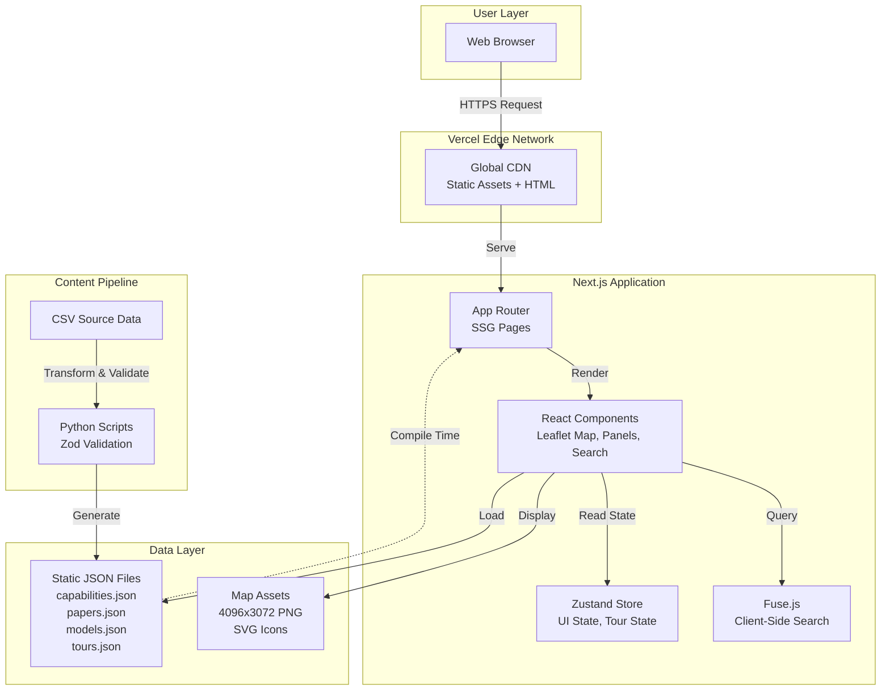
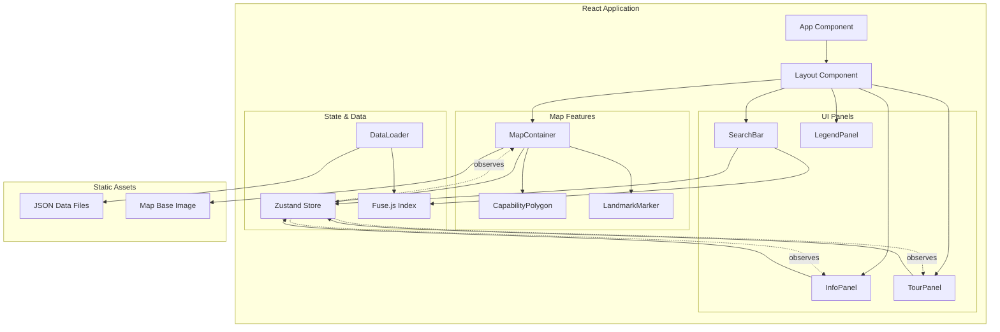
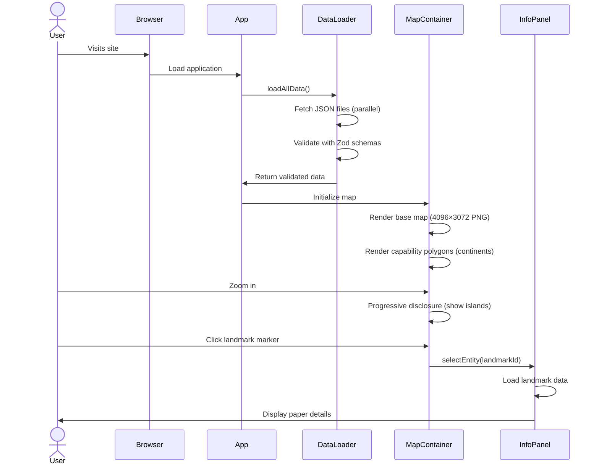
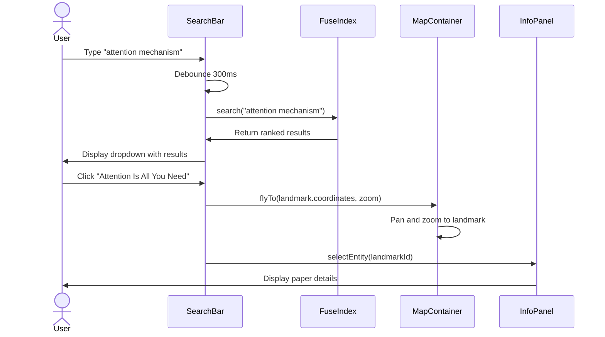
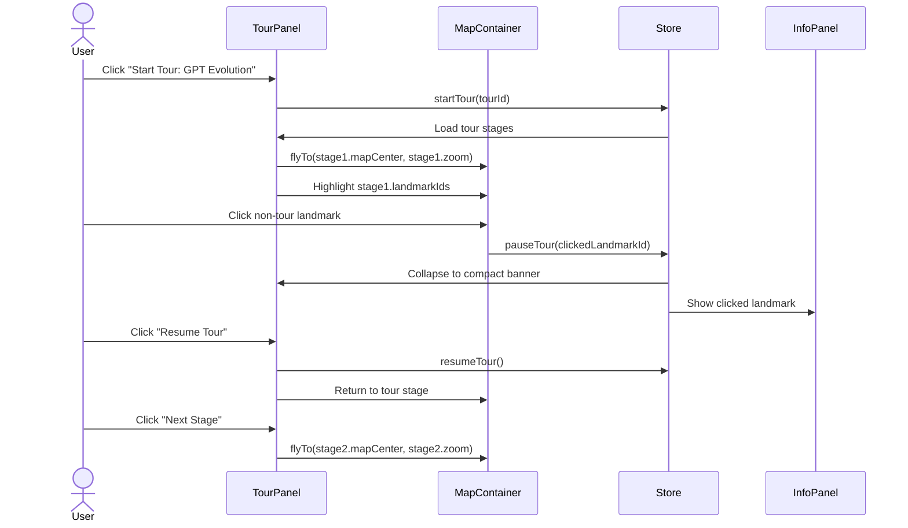

# Terra Incognita Linguae Fullstack Architecture Document

**Version:** 1.0
**Date:** October 1, 2025
**Status:** Draft
**Lead Architect:** Winston

---

## 1. Introduction

This document outlines the complete fullstack architecture for **Terra Incognita Linguae**, including frontend implementation, data management, and deployment strategy. It serves as the single source of truth for AI-driven development, ensuring consistency across the entire technology stack.

This unified approach streamlines development for this modern static-first application where frontend and data concerns are tightly integrated through Next.js's static site generation capabilities.

### 1.1 Starter Template or Existing Project

**Decision:** This is a **greenfield Next.js 14 project** using the App Router.

**Rationale:** The PRD specifies Next.js 14 with App Router, Leaflet.js for mapping, and static JSON data. This is not based on a starter template but will follow Next.js best practices and conventions.

**Constraints Imposed:**
- Must use Next.js 14 App Router architecture
- Static site generation (SSG) is the primary rendering mode
- File-based routing in `/app` directory
- No backend API server needed for MVP (static JSON data)

### 1.2 Change Log

| Date | Version | Description | Author |
|------|---------|-------------|--------|
| 2025-10-01 | 1.0 | Initial architecture based on PRD v1.0 and front-end spec | Winston (Architect) |

---

## 2. High Level Architecture

### 2.1 Technical Summary

**Terra Incognita Linguae** is a **static-first Jamstack application** built with Next.js 14, deployed to Vercel's edge network. The architecture prioritizes performance, developer experience, and zero operational costs through:

- **Frontend:** Next.js 14 (App Router) with React 18, TypeScript, Tailwind CSS + shadcn/ui components
- **Map Visualization:** Leaflet.js with custom fantasy map overlay using CRS.Simple coordinate system
- **State Management:** Zustand for client-side state (map interactions, UI state, tour progression)
- **Data Layer:** Static JSON files in `/public/data` compiled at build time, no runtime database
- **Search:** Client-side Fuse.js for fuzzy search across papers, models, capabilities
- **Deployment:** Vercel with global CDN, automatic HTTPS, and edge caching
- **Content Management:** Manual curation via CSV → JSON pipeline (Python scripts)

This architecture achieves the PRD goals through progressive enhancement: static content with rich client-side interactivity, sub-second page loads, and zero backend infrastructure costs.

### 2.2 Platform and Infrastructure Choice

**Platform:** Vercel

**Key Services:**
- **Hosting:** Vercel Edge Network (global CDN with 100+ edge locations)
- **Build & Deploy:** Vercel CI/CD with automatic deployments from Git
- **Analytics:** Vercel Analytics (Core Web Vitals, user metrics)
- **Storage:** Static assets via Vercel CDN
- **Domain & SSL:** Automatic HTTPS with custom domain support

**Deployment Host and Regions:** Global edge deployment with automatic routing to nearest region

**Rationale:**
1. ✅ **Next.js Native Support:** Zero-config deployment with automatic optimization
2. ✅ **Developer Experience:** Git-based workflow, preview deployments per PR
3. ✅ **Performance:** Edge network ensures <100ms TTFB globally
4. ✅ **Cost:** Generous free tier for MVP, scales with usage
5. ✅ **No Backend Needed:** Static site generation eliminates server costs

**Alternative Considered:** Netlify (similar capabilities) - Vercel chosen for superior Next.js integration

### 2.3 Repository Structure

**Structure:** Monorepo (single repository, multiple packages)

**Monorepo Tool:** npm workspaces (built-in, no additional tooling)

**Package Organization:**
```
llm-map-explorer/
├── src/                    # Next.js application code
├── public/                 # Static assets & JSON data
├── scripts/                # Data pipeline scripts (CSV → JSON)
├── docs/                   # Documentation (PRD, specs, architecture)
└── package.json            # Single package.json (no workspaces needed for MVP)
```

**Rationale:**
- **Simplicity First:** Single Next.js app doesn't require complex monorepo tooling yet
- **Future-Ready:** Easy to split into packages if backend services added post-MVP
- **Developer Friendly:** Simple `npm install` and `npm run dev` to get started
- **Data Co-location:** Scripts and data live alongside application code

### 2.4 High Level Architecture Diagram



### 2.5 Architectural Patterns

- **Jamstack Architecture:** Static site generation with client-side enhancements - _Rationale:_ Optimal performance, security, and scalability for content-heavy applications with no backend requirements

- **Component-Based UI:** Atomic design with shadcn/ui primitives and custom map components - _Rationale:_ Maintainability, reusability, and type safety across the codebase

- **Progressive Disclosure:** Zoom-based rendering with landmark culling (only render markers in viewport + 20% buffer) - _Rationale:_ Performance optimization for 100+ landmarks without degrading map interactions

- **Client-Side State Management:** Zustand for UI state, tour progression, and search results - _Rationale:_ Lightweight alternative to Redux with better TypeScript support and simpler API

- **Static Data Compilation:** JSON files loaded at build time, indexed for search - _Rationale:_ Zero runtime database queries, instant data access, version-controlled content

- **Responsive Map Adapter:** Different interaction patterns for desktop (hover) vs tablet (touch) - _Rationale:_ Optimize UX per device capabilities as specified in front-end spec

---

## 3. Tech Stack

This is the DEFINITIVE technology selection for the entire project. All development must use these exact versions.

| Category | Technology | Version | Purpose | Rationale |
|----------|------------|---------|---------|-----------|
| **Frontend Language** | TypeScript | 5.3+ | Type-safe development | Industry standard for React apps, catches bugs at compile time, excellent IDE support |
| **Frontend Framework** | Next.js | 14.x | React framework with App Router, SSG | Best-in-class React framework with built-in optimization, routing, and static generation |
| **UI Library** | React | 18.x | Component-based UI | Industry standard, vast ecosystem, performant with concurrent features |
| **UI Component Library** | shadcn/ui | Latest | Accessible component primitives | Copy-paste components built on Radix UI, fully customizable with Tailwind |
| **State Management** | Zustand | 4.x | Client-side state | Lightweight (<1KB), simple API, better DX than Redux, TypeScript-first |
| **CSS Framework** | Tailwind CSS | 3.4+ | Utility-first styling | Rapid development, consistent design system, excellent with shadcn/ui |
| **Map Library** | Leaflet.js | 1.9+ | Interactive maps | Mature, lightweight (40KB), supports custom CRS, extensive plugin ecosystem |
| **Map React Bindings** | React-Leaflet | 4.x | React components for Leaflet | Official React wrapper, declarative API, excellent TypeScript support |
| **Search** | Fuse.js | 7.x | Client-side fuzzy search | Lightweight (12KB), fast, supports weighted search across multiple fields |
| **Data Validation** | Zod | 3.x | Runtime schema validation | TypeScript-first, composable schemas, validates JSON data integrity |
| **Frontend Testing** | Vitest | 1.x | Unit & integration tests | Fast (Vite-powered), Jest-compatible API, native ESM support |
| **E2E Testing** | Playwright | 1.40+ | End-to-end tests | Cross-browser, reliable, auto-wait, excellent debugging |
| **Accessibility Testing** | axe-core | 4.x | A11y validation | Industry standard, integrates with Playwright, WCAG 2.1 AA compliance |
| **Build Tool** | Next.js Built-in | 14.x | Compilation & bundling | Zero config, optimized for React, handles SSG/SSR/ISR |
| **Package Manager** | npm | 10.x | Dependency management | Built into Node.js, simple, reliable, no extra tooling |
| **Linting** | ESLint | 8.x | Code quality | Catches bugs, enforces style, Next.js config includes React rules |
| **Code Formatting** | Prettier | 3.x | Consistent formatting | Auto-format on save, integrates with ESLint |
| **CI/CD** | GitHub Actions | N/A | Automated testing & linting | Free for public repos, native Git integration, runs tests on PR |
| **Deployment** | Vercel | N/A | Hosting & CDN | Zero-config Next.js deployment, global edge network, preview deployments |
| **Analytics** | Vercel Analytics | N/A | Performance metrics | Privacy-friendly, Core Web Vitals, user behavior insights |
| **Monitoring** | Vercel Web Analytics | N/A | Real user monitoring | Track errors, performance, user paths |
| **Content Pipeline** | Python | 3.11+ | CSV → JSON conversion | Simple scripting, pandas for data manipulation, JSON generation |

---

## 4. Data Models

Core data models/entities shared between data layer and frontend application.

### 4.1 Capability

**Purpose:** Represents LLM capability regions (continents, archipelagos, islands) on the map. These are geographic polygons that group related research areas.

**Key Attributes:**
- `id`: Unique identifier (e.g., "attention-mechanisms", "alignment")
- `name`: Display name (e.g., "Attention Mechanisms", "Alignment & Safety")
- `description`: Detailed explanation of the capability area
- `shortDescription`: Brief summary for tooltips/previews
- `polygonCoordinates`: Array of lat/lng points defining the region boundary
- `visualStyleHints`: Styling information (fill color, opacity, pattern)
- `relatedLandmarks`: IDs of papers/models within this capability
- `level`: Hierarchy level (continent, archipelago, island)
- `parentCapabilityId`: Optional parent for nested regions

#### TypeScript Interface

```typescript
interface Capability {
  id: string;
  name: string;
  description: string;
  shortDescription: string;
  level: 'continent' | 'archipelago' | 'island';
  polygonCoordinates: LatLng[];
  visualStyleHints: VisualStyle;
  relatedLandmarks: string[];
  parentCapabilityId?: string;
  zoomThreshold: number; // Minimum zoom level to display
}

interface VisualStyle {
  fillColor: string;      // Hex color
  fillOpacity: number;    // 0-1
  strokeColor: string;
  strokeWeight: number;
  pattern?: 'solid' | 'dots' | 'stripes';
}

interface LatLng {
  lat: number;
  lng: number;
}
```

**Relationships:**
- Has many Landmarks (papers, models within the capability region)
- Belongs to Parent Capability (for nested hierarchies)

---

### 4.2 Landmark

**Purpose:** Represents research papers, models, tools, and benchmarks as map markers. These are the primary content entities users explore.

**Key Attributes:**
- `id`: Unique identifier (e.g., "attention-is-all-you-need", "gpt-3")
- `name`: Display title (e.g., "Attention Is All You Need", "GPT-3")
- `type`: Landmark category (paper, model, tool, benchmark)
- `year`: Publication/release year
- `organization`: Primary organization/institution
- `authors`: List of author names (for papers)
- `description`: Short summary (1-2 sentences)
- `abstract`: Full abstract or detailed description
- `externalLinks`: Array of links (arXiv, GitHub, paper PDF, model card)
- `coordinates`: Map position (lat/lng)
- `capabilityId`: Parent capability region
- `relatedLandmarks`: IDs of connected papers/models
- `tags`: Searchable keywords

#### TypeScript Interface

```typescript
interface Landmark {
  id: string;
  name: string;
  type: 'paper' | 'model' | 'tool' | 'benchmark';
  year: number;
  organization: string;
  authors?: string[];
  description: string;
  abstract?: string;
  externalLinks: ExternalLink[];
  coordinates: LatLng;
  capabilityId: string;
  relatedLandmarks: string[];
  tags: string[];
  icon?: string; // Custom icon override
  metadata?: Record<string, any>; // Model-specific (params, etc.)
}

interface ExternalLink {
  type: 'arxiv' | 'github' | 'paper' | 'model-card' | 'website' | 'other';
  url: string;
  label: string;
}
```

**Relationships:**
- Belongs to Capability (geographic region)
- Belongs to Organization (affiliation)
- Has many Related Landmarks (citations, derivatives)

---

### 4.3 Organization

**Purpose:** Represents research institutions, companies, and labs. Used for contextual highlighting and filtering.

**Key Attributes:**
- `id`: Unique identifier (e.g., "google-brain", "openai")
- `name`: Display name (e.g., "Google Brain", "OpenAI")
- `description`: Overview of the organization's focus
- `landmarkIds`: Papers and models from this org
- `website`: Official URL
- `color`: Highlight color for map filtering

#### TypeScript Interface

```typescript
interface Organization {
  id: string;
  name: string;
  description: string;
  website?: string;
  landmarkIds: string[];
  color: string; // Hex color for highlighting
  logo?: string; // Optional logo URL
}
```

**Relationships:**
- Has many Landmarks (papers and models produced)

---

### 4.4 Tour

**Purpose:** Guided learning experiences that walk users through related papers/models in a structured narrative.

**Key Attributes:**
- `id`: Unique identifier (e.g., "gpt-evolution", "rlhf-pipeline")
- `title`: Tour name (e.g., "GPT Evolution", "RLHF Training Pipeline")
- `description`: What users will learn
- `stages`: Ordered steps in the tour
- `estimatedDuration`: Minutes to complete
- `difficulty`: Beginner, intermediate, or advanced

#### TypeScript Interface

```typescript
interface Tour {
  id: string;
  title: string;
  description: string;
  stages: TourStage[];
  estimatedDuration: number; // minutes
  difficulty: 'beginner' | 'intermediate' | 'advanced';
  tags: string[];
}

interface TourStage {
  index: number;
  title: string;
  description: string;
  landmarkIds: string[]; // Landmarks to highlight
  mapCenter: LatLng;     // Where to pan the map
  mapZoom: number;       // Zoom level for this stage
  narration: string;     // Explanatory text
}
```

**Relationships:**
- Has many Stages (ordered steps)
- References many Landmarks (via landmarkIds in stages)

---

### 4.5 Model (Extended Landmark Data)

**Purpose:** Additional metadata for model-type landmarks. Stored within `Landmark.metadata` for models.

#### TypeScript Interface

```typescript
interface ModelMetadata {
  parameters: string;        // e.g., "175B", "7B"
  architecture: string;      // e.g., "Transformer", "GPT"
  trainingMethod: string;    // e.g., "Pre-training + RLHF"
  capabilities: string[];    // e.g., ["text-generation", "reasoning"]
  releaseDate: string;       // ISO date
  license?: string;          // e.g., "MIT", "Proprietary"
  baseModel?: string;        // ID of base model if fine-tuned
}

// Extended Landmark type for models
interface ModelLandmark extends Landmark {
  type: 'model';
  metadata: ModelMetadata;
}
```

---

### 4.6 SearchResult

**Purpose:** Unified search result type returned by Fuse.js across all searchable entities.

#### TypeScript Interface

```typescript
interface SearchResult {
  item: Landmark | Capability | Organization;
  entityType: 'landmark' | 'capability' | 'organization';
  score: number; // Relevance score from Fuse.js
  matches?: SearchMatch[]; // Highlighted match positions
}

interface SearchMatch {
  key: string;   // Field that matched (e.g., "name", "description")
  value: string; // Matched text
  indices: [number, number][]; // Match positions
}
```

---

## 5. Components

Major logical components across the application stack. Since this is a frontend-only application, all components are client-side React components organized by responsibility.

### 5.1 MapContainer

**Responsibility:** Core map rendering and interaction management using Leaflet.js with React-Leaflet bindings.

**Key Interfaces:**
- `initializeMap(baseMapUrl, bounds, defaultZoom)`: Sets up Leaflet map with CRS.Simple
- `handleZoomChange(zoomLevel)`: Updates zoom state, triggers progressive disclosure
- `handlePanChange(center)`: Updates map center, triggers landmark culling
- `renderCapabilityPolygons(capabilities, selectedId)`: Draws geographic regions
- `renderLandmarkMarkers(visibleLandmarks)`: Draws paper/model markers

**Dependencies:**
- Leaflet.js for map rendering
- React-Leaflet for React integration
- Zustand store for map state (zoom, center, selected entity)
- Static JSON data (capabilities, landmarks)

**Technology Stack:**
- React 18 functional components
- Leaflet 1.9+ with CRS.Simple coordinate system
- React-Leaflet 4.x declarative API
- Custom hooks: `useLandmarkCulling`, `useProgressiveDisclosure`

---

### 5.2 InfoPanel

**Responsibility:** Persistent right panel (384px wide, always visible) displaying contextual information with three states: default welcome content, entity details, and tour interface.

**Key Interfaces:**
- `renderWelcomeContent()`: Displays default "How to use" guide, features, and tours list
- `renderEntityDetails(entityId, entityType)`: Shows entity information
- `renderTourContent(tourState)`: Displays active tour stage
- `navigateToRelated(targetId)`: Loads related entity
- `renderCapabilityInfo(capability)`: Displays region details
- `renderLandmarkInfo(landmark)`: Displays paper/model details
- `renderOrganizationInfo(org)`: Displays institution details

**Dependencies:**
- Zustand store for UI state (panel state: 'default' | 'info' | 'tour', active entity)
- Data fetching from static JSON
- shadcn/ui components (ScrollArea, Tabs, Card)

**Technology Stack:**
- React 18 with TypeScript
- Fixed layout panel (not modal/sheet on desktop)
- Bottom sheet (shadcn/ui Sheet) for mobile responsive behavior
- Tailwind CSS for styling (w-96 = 384px width)

---

### 5.3 TourPanel

**Responsibility:** Tour mode within the persistent InfoPanel, providing guided tour interface with stage navigation, progress tracking, and map synchronization.

**Key Interfaces:**
- `startTour(tourId)`: Initializes tour, switches panel to tour mode
- `nextStage()`: Advances to next stage, pans map
- `previousStage()`: Goes back one stage
- `pauseTour(landmarkId)`: Shows clicked landmark while maintaining tour context
- `resumeTour()`: Returns to active tour stage
- `exitTour()`: Closes tour, returns panel to default/welcome state

**Dependencies:**
- Zustand store for tour state (active tour, current stage, paused)
- InfoPanel container (renders tour content)
- MapContainer for pan/zoom control
- Tours JSON data

**Technology Stack:**
- React 18 functional components
- Rendered within InfoPanel (not separate component)
- shadcn/ui Progress component
- Custom keyboard shortcuts ([ and ] for navigation)
- Smooth map transitions via Leaflet.flyTo()

---

### 5.4 SearchBar

**Responsibility:** Client-side fuzzy search across papers, models, capabilities, and organizations using Fuse.js.

**Key Interfaces:**
- `handleSearch(query)`: Executes fuzzy search, returns ranked results
- `filterResults(filter)`: Applies tab filter (All, Papers, Models, etc.)
- `selectResult(result)`: Navigates to selected entity on map
- `initializeIndex(data)`: Creates Fuse.js search index at app startup

**Dependencies:**
- Fuse.js for fuzzy search algorithm
- Static JSON data (all searchable entities)
- Zustand store for search state (query, results, active filter)
- Custom hook: `useDebounceSearch` (300ms delay)

**Technology Stack:**
- React 18 with TypeScript
- Fuse.js 7.x (12KB bundle)
- shadcn/ui Combobox component
- Lodash debounce for performance

---

### 5.5 LegendPanel

**Responsibility:** Explains map symbols, zoom levels, and interaction patterns. Always-visible mini-legend in bottom-right corner.

**Key Interfaces:**
- `renderIconLegend()`: Shows landmark type icons (lighthouse, ship, etc.)
- `renderZoomLegend()`: Explains progressive disclosure levels
- `renderColorLegend()`: Shows capability region colors

**Dependencies:**
- Static configuration for icon meanings
- Zustand store for legend expansion state (optional)

**Technology Stack:**
- React 18 functional component
- shadcn/ui Card component
- SVG icons for landmark types
- Tailwind CSS for positioning (fixed bottom-right)

---

### 5.6 StateManagement (Zustand Store)

**Responsibility:** Centralized client-side state management for map interactions, UI state, tour state, and search state.

**Key Interfaces:**
- `mapState`: Current zoom, center, selected entity, highlighted entities
- `uiState`: Panel visibility (info/tour), search dropdown state
- `tourState`: Active tour, current stage, paused state
- `searchState`: Query, results, active filter
- Actions: `selectEntity()`, `startTour()`, `performSearch()`, etc.

**Dependencies:**
- None (Zustand is standalone)
- Consumed by all UI components

**Technology Stack:**
- Zustand 4.x (<1KB)
- TypeScript interfaces for type safety
- Persist middleware for URL state (optional)

---

### 5.7 DataLoader

**Responsibility:** Loads and validates static JSON data at application startup, initializes search index.

**Key Interfaces:**
- `loadAllData()`: Fetches all JSON files in parallel
- `validateData(data, schema)`: Validates against Zod schemas
- `initializeSearchIndex(landmarks)`: Creates Fuse.js index
- `getCachedData(key)`: Returns memoized data

**Dependencies:**
- Static JSON files in `/public/data`
- Zod for runtime validation
- Fuse.js for search index creation

**Technology Stack:**
- React 18 custom hook: `useDataLoader`
- Zod 3.x for schema validation
- SWR or React Query (optional) for caching

---

### 5.8 Component Diagram



---

## 6. Core Workflows

Key user workflows illustrated through sequence diagrams.

### 6.1 First-Time User Exploration



### 6.2 Search and Navigate Workflow



### 6.3 Guided Tour Workflow



---

## 7. Frontend Architecture

Since this is a frontend-only application, this section covers the complete application architecture.

### 7.1 Component Organization

```
src/
├── app/                          # Next.js 14 App Router
│   ├── layout.tsx                # Root layout with providers
│   ├── page.tsx                  # Homepage (flex layout: map + info panel)
│   └── globals.css               # Global Tailwind imports
├── components/
│   ├── map/
│   │   ├── MapContainer.tsx      # Main Leaflet map component
│   │   ├── CapabilityPolygon.tsx # Geographic region polygons
│   │   ├── LandmarkMarker.tsx    # Paper/model markers
│   │   └── MapEffectController.tsx # Zoom/pan side effects
│   ├── panels/
│   │   ├── InfoPanel.tsx         # Persistent right panel (384px, handles all states)
│   │   ├── WelcomeContent.tsx    # Default welcome/how-to-use content
│   │   ├── EntityDetails.tsx     # Entity info display (capabilities/landmarks)
│   │   ├── TourContent.tsx       # Tour stepper UI within InfoPanel
│   │   └── LegendPanel.tsx       # Map legend (bottom-right overlay)
│   ├── search/
│   │   ├── SearchBar.tsx         # Search input with combobox
│   │   └── SearchResults.tsx     # Results dropdown
│   └── ui/                       # shadcn/ui components
│       ├── button.tsx
│       ├── sheet.tsx
│       ├── card.tsx
│       └── ...                   # Other shadcn components
├── hooks/
│   ├── useDataLoader.ts          # Load and validate JSON data
│   ├── useLandmarkCulling.ts     # Viewport-based marker culling
│   ├── useProgressiveDisclosure.ts # Zoom-based layer visibility
│   ├── useDebounceSearch.ts      # Debounced search input
│   └── useMapState.ts            # Zustand map state hook
├── lib/
│   ├── store.ts                  # Zustand store definition
│   ├── search.ts                 # Fuse.js index initialization
│   ├── schemas.ts                # Zod validation schemas
│   └── utils.ts                  # Utility functions
├── types/
│   ├── data.ts                   # Core data model types
│   ├── map.ts                    # Map-specific types
│   └── index.ts                  # Type exports
└── styles/
    └── map.css                   # Leaflet overrides
```

### 7.2 State Management Architecture

**Zustand Store Structure:**

```typescript
import { create } from 'zustand';

interface AppState {
  mapState: {
    currentZoom: number;
    currentCenter: LatLng;
    selectedEntity: string | null;
    highlightedEntities: string[];
  };
  uiState: {
    infoPanelState: 'default' | 'info' | 'tour';  // Panel always visible, just changes content
  };
  tourState: {
    activeTour: Tour | null;
    currentStage: number;
    isPaused: boolean;
  };
  selectEntity: (id: string, type: string) => void;
  clearSelection: () => void;  // Returns panel to default state
  startTour: (tourId: string) => void;
  exitTour: () => void;  // Returns panel to default state
}
```

---

## 8. Unified Project Structure

```
llm-map-explorer/
├── .github/workflows/
│   ├── ci.yml
│   └── deploy.yml
├── public/
│   ├── data/
│   │   ├── mapFeatures.json
│   │   ├── papers.json
│   │   ├── organizations.json
│   │   └── tours.json
│   └── images/
│       ├── map-base.png
│       └── icons/
├── src/
│   ├── app/
│   ├── components/
│   ├── hooks/
│   ├── lib/
│   ├── types/
│   └── styles/
├── scripts/
│   └── csv-to-json.py
├── tests/
│   ├── unit/
│   ├── integration/
│   └── e2e/
├── docs/
│   ├── prd.md
│   ├── front-end-spec.md
│   └── architecture.md
├── next.config.js
├── tailwind.config.ts
├── tsconfig.json
├── package.json
└── README.md
```

---

## 9. Development Workflow

### 9.1 Local Setup

```bash
# Install dependencies
npm install

# Run development server
npm run dev

# Run tests
npm run test

# Build for production
npm run build
```

### 9.2 Environment Variables

```bash
# .env.local
NEXT_PUBLIC_APP_URL=http://localhost:3000
NEXT_PUBLIC_MAP_BASE_URL=/images/map-base.png
```

---

## 10. Deployment Architecture

### 10.1 Deployment Strategy

- **Platform:** Vercel
- **Build Command:** `npm run build`
- **Output Directory:** `.next`
- **Rendering:** Static Site Generation (SSG)

### 10.2 Environments

| Environment | URL | Purpose |
|-------------|-----|---------|
| Development | localhost:3000 | Local dev |
| Preview | vercel.app | PR previews |
| Production | Custom domain | Live site |

---

## 11. Security and Performance

### 11.1 Security

- **HTTPS Only:** Enforced by Vercel
- **CSP Headers:** Content Security Policy
- **XSS Prevention:** React auto-escaping

### 11.2 Performance

- **Bundle Size:** <150KB gzipped
- **FCP:** <1.5s
- **TTI:** <3s
- **Landmark Culling:** Viewport-based rendering

---

## 12. Testing Strategy

### 12.1 Test Types

- **Unit Tests:** Vitest for hooks and utilities
- **Integration Tests:** React Testing Library
- **E2E Tests:** Playwright for user flows
- **A11y Tests:** axe-core for WCAG compliance

### 12.2 Test Coverage Goals

- Unit tests: >80% coverage
- Critical user paths: 100% E2E coverage
- Zero WCAG violations

---

## 13. Coding Standards

### 13.1 Critical Rules

- **Type Safety:** No `any` types
- **Data Access:** Use `useDataLoader` hook
- **State Management:** Zustand actions only
- **Accessibility:** aria-labels and keyboard support
- **Performance:** React.memo for pure components

### 13.2 Naming Conventions

| Element | Convention | Example |
|---------|------------|---------|
| Components | PascalCase | MapContainer.tsx |
| Hooks | use + camelCase | useDataLoader.ts |
| Types | PascalCase | Landmark, Tour |
| Actions | camelCase | selectEntity |

---

## 14. Error Handling

### 14.1 Error Types

- **DataLoadError:** Failed JSON fetch
- **ValidationError:** Zod schema failure
- **MapRenderError:** Leaflet rendering issues

### 14.2 Error Boundaries

```typescript
// app/error.tsx
export default function Error({ error, reset }: { error: Error; reset: () => void }) {
  return (
    <div>
      <h2>Something went wrong!</h2>
      <button onClick={reset}>Try again</button>
    </div>
  );
}
```

---

## 15. Monitoring

### 15.1 Metrics

- **Core Web Vitals:** LCP, FID, CLS
- **Custom Metrics:** Map render time, search latency
- **Error Tracking:** Vercel Error Monitoring

---

## 16. Summary

This architecture defines a **static-first Jamstack application** optimized for performance and developer experience:

### Key Decisions:

✅ Next.js 14 + Vercel for SSG with global CDN
✅ TypeScript + Zod for type safety
✅ Zustand for lightweight state management
✅ Client-side search with Fuse.js
✅ Zero backend infrastructure

### Ready for Development:

All technical decisions documented, data models defined, component responsibilities clear.

**Next Steps:**
1. Bootstrap Next.js 14 project
2. Implement data models and schemas
3. Build MapContainer component
4. Follow 12-week roadmap from PRD

---

**Document Version:** 1.0
**Last Updated:** October 1, 2025
**Status:** ✅ Complete and Ready for Development
