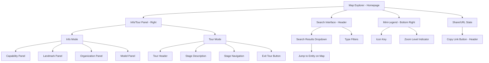
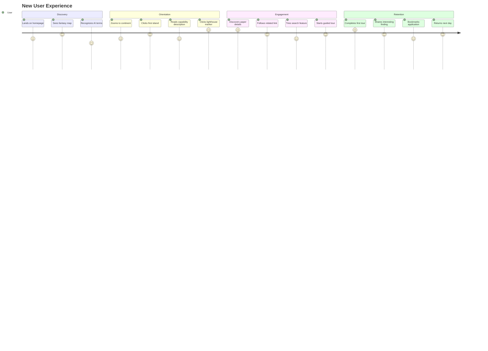

# UI/UX Specification: Terra Incognita Linguae
## Pixel-Perfect Component Specifications

**Version:** 1.0
**Date:** October 1, 2025
**Status:** Ready for Design & Development
**Lead UX Designer:** Sally (UX Expert)
**Project:** LLM Research Explorer

**Architectural Alignment Note:** This specification is fully aligned with the technical architecture decisions documented in [architecture.md](architecture.md). Key design decisions:
- ✅ Right panel serves dual purpose: Info mode (default) + Tour mode (when tour active)
- ✅ No separate timeline panel in MVP (timeline data accessible via search)
- ✅ Tours use panel stepper UI instead of separate route/page
- ✅ Tour pause/resume functionality with seamless panel mode switching

---

## Document Purpose

This document defines the user experience goals, information architecture, user flows, and visual design specifications for Terra Incognita Linguae's user interface. It provides pixel-perfect wireframe specifications that can be directly translated to Figma frames and developer implementation.

---

## Quick Reference for Implementation

**For UI/UX Design & Figma Translation:**
- **Wireframes**: [Section 6](#6-pixel-perfect-wireframes) - Pixel-perfect ASCII layouts with exact measurements
  - Main map view, info panels, tour panels, search interface, responsive breakpoints
- **Style Guide**: [Section 8](#8-branding--style-guide) - Colors, typography, icons, spacing
- **Animation Specs**: [Section 11](#11-animation--micro-interactions) - Motion principles and timing
- **Responsive Design**: [Section 10](#10-responsiveness-strategy) - Breakpoints and adaptation patterns

**For Frontend Component Development:**
- **Component Interfaces**: [Section 14.1](#141-component-specifications) - TypeScript interfaces for all components
- **State Management**: [Section 14.2](#142-state-management-architecture) - Zustand store structure
- **Data Models**: [Section 14.1](#141-component-specifications) - Capability, Landmark, Tour types
- **Performance Patterns**: [Section 14.4](#144-performance-requirements-with-code-examples) - Culling, debouncing, memoization

**For Accessibility Implementation:**
- **WCAG Requirements**: [Section 9](#9-accessibility-requirements) - WCAG 2.1 AA compliance
- **ARIA Examples**: [Section 14.5](#145-accessibility-implementation-with-aria-examples) - Complete ARIA implementation
- **Keyboard Navigation**: [Section 14.6](#146-keyboard-navigation-map) - Keyboard shortcut map

**For API & Data Integration:**
- **Data Loading**: [Section 14.3](#143-api-integration-requirements) - JSON data fetching strategy
- **Search Implementation**: [Section 14.3](#143-api-integration-requirements) - Fuse.js search index setup

**For Testing & Quality Assurance:**
- **Success Metrics**: [Section 13](#13-success-metrics--kpis) - KPIs for UX, performance, accessibility
- **User Journeys**: [Section 4](#4-user-journey-mapping) - Expected emotional states and pain points
- **Testing Schedule**: [Section 15.5](#155-user-testing-schedule) - User testing checkpoints

**For Project Planning:**
- **Implementation Roadmap**: [Section 15](#15-implementation-roadmap) - 16-week phased rollout plan
  - Phase 1: Core Map (Weeks 1-4)
  - Phase 2: Discovery & Panels (Weeks 5-8)
  - Phase 3: Tours & Navigation (Weeks 9-12)
  - Phase 4: Polish & Optimization (Weeks 13-16)
- **Design Philosophy**: [Section 1](#1-ux-design-philosophy) - Core vision and principles

**For Understanding User Needs:**
- **User Personas**: [Section 2.1](#21-overall-ux-goals--principles) - Sarah, Alex, Dr. Patel, Jordan
- **Design Principles**: [Section 1](#1-ux-design-philosophy) - Progressive disclosure, spatial memory
- **Pain Points**: [Section 4.4](#44-pain-point-resolution) - Traditional docs vs our solutions

---

## Table of Contents

1. [UX Design Philosophy](#1-ux-design-philosophy)
2. [Introduction & UX Goals](#2-introduction--ux-goals)
3. [Information Architecture](#3-information-architecture)
4. [User Journey Mapping](#4-user-journey-mapping)
5. [User Flows](#5-user-flows)
6. [Pixel-Perfect Wireframes](#6-pixel-perfect-wireframes)
7. [Component Library](#7-component-library)
8. [Branding & Style Guide](#8-branding--style-guide)
9. [Accessibility Requirements](#9-accessibility-requirements)
10. [Responsiveness Strategy](#10-responsiveness-strategy)
11. [Animation & Micro-interactions](#11-animation--micro-interactions)
12. [Performance Considerations](#12-performance-considerations)
13. [Success Metrics & KPIs](#13-success-metrics--kpis)
14. [Development Handoff](#14-development-handoff)
15. [Implementation Roadmap](#15-implementation-roadmap)
16. [Conclusion & Vision](#16-conclusion--vision)

---

## 1. UX Design Philosophy

### Core UX Vision

*"Transform the complex landscape of LLM research into an intuitive exploration canvas where every user becomes a confident navigator of AI knowledge."*

The UX must bridge the gap between:
- **Depth**: Comprehensive coverage of LLM research with academic rigor
- **Accessibility**: Intuitive interface that welcomes learners at all levels
- **Discovery**: Tools that make exploration rewarding and knowledge retention natural

### Design Philosophy

Terra Incognita Linguae reimagines how we interact with technical knowledge by leveraging spatial memory and geographic metaphors. Instead of overwhelming users with hierarchical taxonomies or dense tables, we create a world where:

1. **Location Creates Context** - Papers and models exist in geographic space, making relationships and groupings intuitive ("RLHF papers are near the Alignment continent")

2. **Exploration Drives Learning** - Users navigate naturally through zoom levels, discovering details progressively rather than being confronted with everything at once

3. **Visual Storytelling** - Islands represent capabilities, lighthouses mark papers, ships denote models—concrete metaphors make abstract concepts tangible

4. **Spatial Memory as Cognitive Aid** - Research shows humans remember locations exceptionally well; we harness this to make LLM knowledge "stick"

### Guiding Design Principles

1. **Exploration Over Instruction**
   - Let users discover through interaction rather than walls of text
   - The map invites clicking and zooming naturally
   - Curiosity drives engagement, not prescribed learning paths

2. **Progressive Disclosure**
   - Show continents first, reveal archipelagos on zoom, display landmarks at close range
   - Prevent cognitive overload while maintaining depth
   - Information appears when users need it, not all at once

3. **Visual Storytelling**
   - Use geography metaphor consistently (islands = capabilities, lighthouses = papers, ships = models, routes = pipelines)
   - Make abstract concepts tangible through spatial relationships
   - Create memorable visual anchors for complex ideas

4. **Spatial Memory as Learning Aid**
   - Leverage natural ability to remember locations
   - "RLHF is near the Alignment continent" creates stronger mental models than text hierarchies
   - Location-based learning improves retention and recall

5. **Clarity in Complexity**
   - The LLM landscape is inherently complex; our job is to make it navigable, not to oversimplify
   - Provide depth without density
   - Respect user intelligence while reducing friction

---

## 2. Introduction & UX Goals

### 2.1. Overall UX Goals & Principles

#### Target User Personas

**1. CS Student (Sarah)**
- **Profile:** Undergraduate/graduate student studying AI/ML
- **Context:** Needs to understand LLM fundamentals for coursework or research projects
- **Key Needs:** Clear concept explanations, historical context, paper recommendations
- **Pain Points:** Overwhelmed by dense academic papers, unsure where to start
- **Success Metric:** Can explain core LLM concepts and cite key papers after 2-3 sessions

**2. Software Developer (Alex)**
- **Profile:** Developer exploring LLM integration into applications
- **Context:** Building products that leverage LLMs, needs practical knowledge
- **Key Needs:** Technical details, model comparisons, implementation guidance, training pipeline understanding
- **Pain Points:** Fragmented documentation, unclear which models fit which tasks
- **Success Metric:** Can select appropriate models and understand training approaches for specific use cases

**3. ML Researcher (Dr. Patel)**
- **Profile:** Researcher tracking LLM advancements
- **Context:** Publishing papers, needs to stay current with latest techniques and identify research gaps
- **Key Needs:** Comprehensive coverage, cross-referencing, organization-based filtering, historical progression
- **Pain Points:** Information overload, difficulty tracking related work across organizations
- **Success Metric:** Discovers new papers and connections between research areas efficiently

**4. AI Enthusiast (Jordan)**
- **Profile:** Tech-savvy individual curious about AI developments
- **Context:** Following AI news, wants to understand the landscape without deep technical background
- **Key Needs:** Accessible explanations, engaging visuals, clear progression paths
- **Pain Points:** Technical jargon, lack of contextual framing, no "big picture" view
- **Success Metric:** Understands major LLM developments and can follow AI news with context

---

#### Usability Goals

1. **Immediate Orientation** - Users understand the map metaphor within 30 seconds of landing
2. **Progressive Discovery** - New users aren't overwhelmed; complexity reveals itself naturally as they explore
3. **Efficient Navigation** - Power users can jump to specific papers/models via search in <10 seconds
4. **Memorable Learning** - Spatial layout creates mental anchors that aid retention and recall
5. **Low Friction Exploration** - Users can browse and click freely without fear of "breaking" anything or getting lost
6. **Cross-Device Accessibility** - Core exploration works on desktop and tablets (mobile-friendly layout)

---

#### Design Principles

1. **Exploration Over Instruction** - Let users discover through interaction rather than walls of text; the map invites clicking and zooming naturally

2. **Progressive Disclosure** - Show continents first, reveal archipelagos on zoom, display landmarks at close range; prevent cognitive overload while maintaining depth

3. **Visual Storytelling** - Use the geography metaphor consistently (islands = capabilities, lighthouses = papers, ships = models, routes = pipelines); make abstract concepts tangible

4. **Spatial Memory as Learning Aid** - Leverage users' natural ability to remember locations; "RLHF is near the Alignment continent" creates stronger mental models than text hierarchies

5. **Clarity in Complexity** - The LLM landscape is inherently complex; our job is to make it navigable, not to oversimplify; provide depth without density

---

### 2.2. Change Log

| Date | Version | Description | Author |
|------|---------|-------------|--------|
| 2025-10-01 | 1.0 | Initial UI/UX specification created | Sally (UX Expert) |

---

## 3. Information Architecture

### 3.1. Site Map / Screen Inventory



### 3.2. Navigation Structure

**Primary Navigation:**
The map canvas is the primary navigation surface:
- Pan/zoom to explore geographic regions
- Click polygons (capabilities/islands) → opens Info Panel (right)
- Click markers (landmarks) → opens Info Panel (right)
- Search bar (header) for direct access

**Secondary Navigation:**

- **Right Panel - Context-Sensitive Display:**
  - **Info Mode (default):** Shows details of selected map entity
    - Auto-opens on entity selection
    - Close via X or Esc
    - Internal links navigate between related entities

  - **Tour Mode (activated):** Shows guided tour stepper
    - Tour selected from search or tour catalog
    - **Stage navigation:** Previous/Next buttons + keyboard `[` `]`
    - Each stage auto-pans map and highlights relevant landmark(s)
    - **Exit Tour** button returns to Info Mode
    - User can still free-explore map while tour panel is open (tour pauses, shows "Resume Tour" option)

- **Top Header:**
  - App branding (click returns to default map view)
  - Search bar with instant dropdown
  - Copy Link/Share button

- **Bottom Right - Mini-Legend (Always Visible):**
  - Compact, non-intrusive
  - Shows: Icon meanings, current zoom level indicator
  - Always visible during exploration

**Breadcrumb Strategy:**
Not applicable - spatial map provides context. Tour mode shows current stage progress inline within the tour panel (e.g., "Stage 3 of 5: RLHF Training").

---

## 4. User Journey Mapping

### 4.1. First-Time User Journey



### 4.2. Key User Moments

**The "Aha!" Moment**: When a user realizes the map metaphor reveals relationships they never saw in traditional documentation—"Oh, RLHF is literally *near* the Alignment continent because they're conceptually related!"

**The "Share This" Moment**: When discovering a seminal paper's location and connections, users feel compelled to share the visualization—"This map shows the Transformer architecture's influence better than any diagram I've seen."

**The "I Get It Now" Moment**: After exploring a guided tour, abstract concepts like "pre-training → fine-tuning → RLHF" become concrete spatial journeys that stick in memory.

### 4.3. Emotional Journey Mapping

**Sarah (CS Student) - First Research Paper Discovery**

| Phase | Action | Emotion | UI Support |
|-------|--------|---------|------------|
| **Uncertainty** | Needs to understand Transformers | Overwhelmed 😰 | Progressive disclosure, friendly entry point |
| **Discovery** | Finds "Attention Is All You Need" | Curious 🤔 | Clear landmark icon, hover preview |
| **Comprehension** | Reads short description + abstract | Engaged 😊 | Expandable details, layman summary |
| **Connection** | Sees related papers (BERT, GPT) | Enlightened 💡 | Related entities section, visual connections |
| **Confidence** | Follows tour on Transformer family | Empowered 🎓 | Guided tour with clear progression |
| **Mastery** | Can explain concept to classmates | Accomplished 🌟 | Share feature, bookmark capability |

**Alex (Developer) - Model Selection Journey**

| Phase | Action | Emotion | UI Support |
|-------|--------|---------|------------|
| **Need** | Must choose LLM for project | Pressured ⏰ | Quick search bar, filter by use case |
| **Exploration** | Searches "instruction following" | Focused 🎯 | Instant results, relevant suggestions |
| **Analysis** | Compares GPT-3, Flan, InstructGPT | Analytical 🧐 | Side-by-side info panels, parameter comparison |
| **Insight** | Discovers RLHF training distinction | Informed 📊 | Clear technical details, training pipeline visualization |
| **Decision** | Chooses InstructGPT approach | Confident ✅ | External links to docs, implementation guides |
| **Sharing** | Shares finding with team | Collaborative 👥 | Copy link with selected state, annotations |

### 4.4. Pain Point Resolution

**Traditional Documentation Pain Points → Terra Incognita Solutions**

| Pain Point | User Quote | Our Solution |
|------------|------------|--------------|
| **Overwhelming info density** | "I don't know where to start with LLM research" | Progressive disclosure via zoom levels |
| **Lost in hyperlinks** | "I clicked 10 links and forgot what I was looking for" | Spatial context always visible on map |
| **No big picture** | "I can't see how everything fits together" | Continental organization shows high-level structure |
| **Dry technical docs** | "Reading papers is exhausting" | Engaging visual metaphors, digestible summaries |
| **Fragmented knowledge** | "Information is scattered across arXiv, blogs, docs" | Centralized, curated map with consistent structure |
| **Difficult to remember** | "I read about this last week but can't recall details" | Spatial memory aids: "It was on the northwest island" |

---

## 5. User Flows

*(User flows documented separately to keep wireframes document focused. See "User Flows Summary" in PRD.)*

**Key Flows Supported:**
1. First-Time Visitor Exploration
2. Search for Specific Paper
3. Following a Guided Tour
4. Organization-Based Discovery

---

## 6. Pixel-Perfect Wireframes

### 6.1. Main Map View (Default State)

**Desktop Layout (1920px × 1080px - Primary Target)**

```
┌─ HEADER NAVIGATION (1920px × 64px) ─────────────────────────────────────────┐
│ Terra Incognita Linguae    🔍 [Search...]    [🔗 Share]         [☰ Legend] │
│ [32px left padding]         [600px width]    [120px × 40px]     [40×40]    │
│                             [24px gaps between elements]                     │
└─────────────────────────────────────────────────────────────────────────────┘

┌─ MAIN CONTENT AREA (1920px × 936px) ───────────────────────────────────────┐
│                                                                             │
│ ┌─ INTERACTIVE MAP CONTAINER (1920px × 936px) ──────────────────────────┐  │
│ │                                                                         │  │
│ │  🗺️ LEAFLET MAP CANVAS                                                 │  │
│ │     Full width: 1920px × 936px                                         │  │
│ │     CRS.Simple coordinate system                                        │  │
│ │     Base map: 4096 × 3072 PNG overlay                                  │  │
│ │                                                                         │  │
│ │  ┌─ MAP FEATURES ─────────────────────────────────────────────────────┐ │  │
│ │  │ • CONTINENT POLYGONS (visible at zoom -1 to 0)                    │ │  │
│ │  │   Fill: Semi-transparent themed colors                             │ │  │
│ │  │   Stroke: 2px solid borders                                        │ │  │
│ │  │   Hover: 3px stroke + glow effect                                  │ │  │
│ │  │                                                                     │ │  │
│ │  │ • ISLAND POLYGONS (visible at zoom 0 to 1)                        │ │  │
│ │  │   Fill: Themed colors with opacity 0.6                             │ │  │
│ │  │   Labels: 14px font, appear on zoom                                │ │  │
│ │  │                                                                     │ │  │
│ │  │ • LANDMARK MARKERS (visible at zoom 1+)                            │ │  │
│ │  │   Icons: 32px × 32px SVG                                           │ │  │
│ │  │   Types: Lighthouse, Ship, Anchor, Flag                            │ │  │
│ │  │   Hover: Scale 1.2 + tooltip preview                               │ │  │
│ │  └─────────────────────────────────────────────────────────────────────┘ │  │
│ │                                                                         │  │
│ │  ┌─ MINI-LEGEND (280px × 140px) ────────────────────────────────────┐  │  │
│ │  │  Position: Bottom-right + 24px margin from edges                 │  │  │
│ │  │  Background: rgba(255,255,255,0.95)                              │  │  │
│ │  │  Border-radius: 12px                                             │  │  │
│ │  │  Box-shadow: 0 4px 16px rgba(0,0,0,0.15)                         │  │  │
│ │  │  Padding: 16px                                                    │  │  │
│ │  │                                                                   │  │  │
│ │  │  🏛️ Lighthouse = Paper                                           │  │  │
│ │  │  🚢 Ship = Model                                                 │  │  │
│ │  │  ⚓ Anchor = Tool                                                 │  │  │
│ │  │  🚩 Flag = Benchmark                                             │  │  │
│ │  │                                                                   │  │  │
│ │  │  📍 Zoom: Continent View                                         │  │  │
│ │  └───────────────────────────────────────────────────────────────────┘  │  │
│ │                                                                         │  │
│ └─────────────────────────────────────────────────────────────────────────┘  │
│                                                                             │
│ [Right panel slides in from right edge when entity selected: 480px width]  │
│                                                                             │
└─────────────────────────────────────────────────────────────────────────────┘

TOTAL HEIGHT: 64px (header) + 936px (map) + 80px (footer spacing) = 1080px
```

#### Component Specifications

**Header Bar**
- Height: 64px
- Background: Linear gradient from #1a1a2e to #16213e
- Border-bottom: 1px solid rgba(255,255,255,0.1)
- Box-shadow: 0 2px 8px rgba(0,0,0,0.1)
- z-index: 100

**App Branding**
- Font: "Inter", 20px, weight 700
- Color: #ffffff
- Left padding: 32px
- Cursor: pointer (returns to default map view)

**Search Bar**
- Width: 600px
- Height: 40px
- Background: rgba(255,255,255,0.1)
- Border: 1px solid rgba(255,255,255,0.2)
- Border-radius: 20px
- Font: "Inter", 14px
- Placeholder color: rgba(255,255,255,0.5)
- Focus: Border 2px solid #4a9eff, Background rgba(255,255,255,0.15)
- Padding: 0 16px 0 40px (left padding for search icon)

**Share Button**
- Width: 120px
- Height: 40px
- Background: rgba(255,255,255,0.1)
- Border: 1px solid rgba(255,255,255,0.2)
- Border-radius: 8px
- Font: "Inter", 14px, weight 500
- Color: #ffffff
- Hover: Background rgba(255,255,255,0.2)
- Active: Background rgba(255,255,255,0.15)

**Mini-Legend**
- Width: 280px
- Height: 140px
- Position: Absolute bottom-right (24px margins)
- Background: rgba(255,255,255,0.95)
- Backdrop-filter: blur(10px)
- Border-radius: 12px
- Box-shadow: 0 4px 16px rgba(0,0,0,0.15)
- Padding: 16px
- z-index: 50

**Mini-Legend Items**
- Icon size: 20px × 20px
- Font: "Inter", 13px
- Line height: 24px
- Color: #2c3e50
- Gap between items: 8px

---

### 6.2. Responsive Breakpoints

#### Tablet (768px - 1024px)

```
┌─ HEADER (768px × 56px) ──────────────────────────────┐
│ Terra...    🔍 [Search]    [Share] [☰]              │
│ [16px pad]  [400px]        [80px]  [40px]           │
└──────────────────────────────────────────────────────┘

┌─ MAP AREA (768px × 944px) ───────────────────────────┐
│ 🗺️ MAP CANVAS (768px × 944px)                       │
│    Touch-optimized controls                          │
│    Pinch zoom, two-finger pan                        │
│                                                       │
│ ┌─ MINI-LEGEND (240px × 120px) ──────────────────┐   │
│ │ Position: Bottom-right + 16px margin           │   │
│ │ Slightly smaller for tablet                    │   │
│ └─────────────────────────────────────────────────┘   │
└──────────────────────────────────────────────────────┘

[Right panel becomes full-width slide-up sheet from bottom]
┌─ SLIDE-UP INFO PANEL (768px × 400px) ────────────────┐
│ [Drag handle: 48px × 4px centered]                   │
│ Content area: 768px × 352px                           │
│ Expandable to 80% of viewport height                  │
└──────────────────────────────────────────────────────┘
```

#### Mobile (375px - 767px)

```
┌─ MOBILE HEADER (375px × 48px) ─┐
│ 🗺️ TIL    🔍    [☰]           │
│ [12px]  [40px] [40px]          │
└────────────────────────────────┘

┌─ MAP VIEW (375px × 500px) ─────┐
│ 🗺️ Touch-optimized map        │
│    Simplified view priority     │
│    Larger tap targets (44px min)│
│                                 │
│ ┌─ MINI-LEGEND (180px × 100px)┐│
│ │ Compact icon key             ││
│ │ Bottom-right 12px margin     ││
│ └──────────────────────────────┘│
└────────────────────────────────┘

┌─ BOTTOM SHEET PANEL ───────────┐
│ (375px × 60vh)                  │
│ Slides up from bottom           │
│ Collapsible with drag gesture  │
│ Backdrop dim: rgba(0,0,0,0.4)  │
└────────────────────────────────┘
```

---

### 6.3. Map with Landmark Info Panel

**Panel Layout (1920px × 1080px total, Panel: 480px × 936px)**

```
┌─ MAP WITH INFO PANEL ACTIVE ────────────────────────────────────────────────┐
│                                                                             │
│ ┌─ MAP CANVAS (1440px × 936px) ──┬─ RIGHT INFO PANEL (480px × 936px) ─────┐│
│ │                                 │                                        ││
│ │  🗺️ Map with selected landmark │ ┌─ PANEL HEADER (480px × 64px) ──────┐││
│ │     highlighted (pulse glow)    │ │ [✕]                      PAPER     │││
│ │                                 │ │ Close btn (40×40, top-right 16px)  │││
│ │     Selected landmark:          │ └────────────────────────────────────┘││
│ │     • 4px blue glow ring        │                                        ││
│ │     • Pulsing animation 2s      │ ┌─ PANEL CONTENT (480px × 872px) ───┐││
│ │     • Z-index raised            │ │ Padding: 24px                      │││
│ │                                 │ │ Scrollable overflow                │││
│ │                                 │ │                                    │││
│ │                                 │ │ ┌─ TITLE SECTION ────────────────┐│││
│ │                                 │ │ │ "Attention Is All You Need"    ││││
│ │                                 │ │ │ Font: Inter, 24px, weight 700  ││││
│ │                                 │ │ │ Color: #1a1a2e                 ││││
│ │                                 │ │ │ Line-height: 32px              ││││
│ │                                 │ │ │ Margin-bottom: 16px            ││││
│ │                                 │ │ └────────────────────────────────┘│││
│ │                                 │ │                                    │││
│ │                                 │ │ ┌─ METADATA BADGES ──────────────┐│││
│ │                                 │ │ │ [Seminal Paper] [2017]         ││││
│ │                                 │ │ │ Badge height: 28px             ││││
│ │                                 │ │ │ Padding: 6px 12px              ││││
│ │                                 │ │ │ Border-radius: 14px            ││││
│ │                                 │ │ │ Background: #e3f2fd            ││││
│ │                                 │ │ │ Color: #1565c0                 ││││
│ │                                 │ │ │ Font: 13px, weight 600         ││││
│ │                                 │ │ │ Gap: 8px                       ││││
│ │                                 │ │ └────────────────────────────────┘│││
│ │                                 │ │                                    │││
│ │                                 │ │ ┌─ LOCATION ─────────────────────┐│││
│ │                                 │ │ │ 📍 Transformer Architecture    ││││
│ │                                 │ │ │    Island                       ││││
│ │                                 │ │ │ Font: 14px, color: #546e7a     ││││
│ │                                 │ │ │ Link style (clickable)         ││││
│ │                                 │ │ └────────────────────────────────┘│││
│ │                                 │ │                                    │││
│ │                                 │ │ ┌─ AUTHORS ──────────────────────┐│││
│ │                                 │ │ │ 👥 Vaswani, Shazeer, Parmar   ││││
│ │                                 │ │ │    et al. (Google)             ││││
│ │                                 │ │ │ Font: 14px                     ││││
│ │                                 │ │ │ Organization linked            ││││
│ │                                 │ │ └────────────────────────────────┘│││
│ │                                 │ │                                    │││
│ │                                 │ │ ┌─ DIVIDER ──────────────────────┐│││
│ │                                 │ │ │ Height: 1px                    ││││
│ │                                 │ │ │ Color: #e0e0e0                 ││││
│ │                                 │ │ │ Margin: 20px 0                 ││││
│ │                                 │ │ └────────────────────────────────┘│││
│ │                                 │ │                                    │││
│ │                                 │ │ ┌─ SHORT DESCRIPTION ────────────┐│││
│ │                                 │ │ │ "The seminal paper            ││││
│ │                                 │ │ │ introducing the Transformer    ││││
│ │                                 │ │ │ architecture..."               ││││
│ │                                 │ │ │                                ││││
│ │                                 │ │ │ Font: 15px, line-height 24px  ││││
│ │                                 │ │ │ Color: #37474f                 ││││
│ │                                 │ │ └────────────────────────────────┘│││
│ │                                 │ │                                    │││
│ │                                 │ │ ┌─ EXPANDABLE DETAILS ───────────┐│││
│ │                                 │ │ │ [▼ Read Full Abstract]         ││││
│ │                                 │ │ │ Accordion style                ││││
│ │                                 │ │ │ Expanded: Shows full text      ││││
│ │                                 │ │ └────────────────────────────────┘│││
│ │                                 │ │                                    │││
│ │                                 │ │ ┌─ EXTERNAL LINKS ───────────────┐│││
│ │                                 │ │ │ [📄 Read Paper ➜]             ││││
│ │                                 │ │ │ Primary CTA button             ││││
│ │                                 │ │ │ Width: 100%, Height: 44px      ││││
│ │                                 │ │ │ Background: #1976d2            ││││
│ │                                 │ │ │ Border-radius: 8px             ││││
│ │                                 │ │ │ Font: 15px, weight 600         ││││
│ │                                 │ │ │ Margin-bottom: 12px            ││││
│ │                                 │ │ │                                ││││
│ │                                 │ │ │ [arXiv] [GitHub] [Citations]   ││││
│ │                                 │ │ │ Secondary link buttons         ││││
│ │                                 │ │ │ Height: 36px, inline-flex      ││││
│ │                                 │ │ │ Border: 1px solid #bdbdbd      ││││
│ │                                 │ │ └────────────────────────────────┘│││
│ │                                 │ │                                    │││
│ │                                 │ │ ┌─ RELATED ENTITIES ─────────────┐│││
│ │                                 │ │ │ 🔗 Related Papers (3)          ││││
│ │                                 │ │ │ ┌──────────────────────────────┤││
│ │                                 │ │ │ │ • BERT (Clickable)         │││││
│ │                                 │ │ │ │ • GPT-1 (Clickable)        │││││
│ │                                 │ │ │ │ • Show more...             │││││
│ │                                 │ │ │ └────────────────────────────┘│││
│ │                                 │ │ │                                ││││
│ │                                 │ │ │ 🚢 Used in Models (5)          ││││
│ │                                 │ │ │ ┌──────────────────────────────┤││
│ │                                 │ │ │ │ • GPT-2 (Clickable)        │││││
│ │                                 │ │ │ │ • BERT (Clickable)         │││││
│ │                                 │ │ │ │ • Show all...              │││││
│ │                                 │ │ │ └────────────────────────────┘│││
│ │                                 │ │ │                                ││││
│ │                                 │ │ │ 🗺️ Part of Tours (2)          ││││
│ │                                 │ │ │ ┌──────────────────────────────┤││
│ │                                 │ │ │ │ • Foundation Models Tour   │││││
│ │                                 │ │ │ │ • Transformer Architecture │││││
│ │                                 │ │ │ └────────────────────────────┘│││
│ │                                 │ │ └────────────────────────────────┘││
│ │                                 │ │                                    │││
│ │                                 │ │ ┌─ TAGS ─────────────────────────┐│││
│ │                                 │ │ │ [transformer] [attention]      ││││
│ │                                 │ │ │ [nlp] [foundation]             ││││
│ │                                 │ │ │ Pill style, 24px height        ││││
│ │                                 │ │ │ Background: #f5f5f5            ││││
│ │                                 │ │ └────────────────────────────────┘│││
│ │                                 │ └────────────────────────────────────┘││
│ │                                 └────────────────────────────────────────┘│
│ └─────────────────────────────────┘                                        │
└─────────────────────────────────────────────────────────────────────────────┘
```

#### Info Panel Component Specifications

**Panel Container**
- Width: 480px (25% of 1920px viewport)
- Height: 936px (full height minus header)
- Background: #ffffff
- Box-shadow: -4px 0 24px rgba(0,0,0,0.1)
- Position: Fixed right
- Animation: Slide in from right, 300ms ease-out
- z-index: 200

**Close Button**
- Size: 40px × 40px
- Position: Absolute top-right (16px margin)
- Background: Transparent
- Hover: Background rgba(0,0,0,0.05)
- Icon: ✕ symbol, 20px, color #616161
- Border-radius: 50%

**Panel Content Scroll**
- Padding: 24px
- Overflow-y: auto
- Custom scrollbar: 8px width, #e0e0e0 track, #9e9e9e thumb

**Title**
- Font: "Inter", 24px, weight 700
- Color: #1a1a2e
- Line-height: 32px
- Margin-bottom: 16px

**Metadata Badges**
- Display: inline-flex
- Height: 28px
- Padding: 6px 12px
- Border-radius: 14px
- Font: 13px, weight 600
- Gap: 8px
- Margin-bottom: 16px

**Primary CTA Button**
- Width: 100%
- Height: 44px
- Background: #1976d2
- Color: #ffffff
- Border-radius: 8px
- Font: 15px, weight 600
- Box-shadow: 0 2px 8px rgba(25,118,210,0.3)
- Hover: Background #1565c0, transform translateY(-1px)
- Active: Background #0d47a1

**Secondary Link Buttons**
- Display: inline-flex
- Height: 36px
- Padding: 0 16px
- Border: 1px solid #bdbdbd
- Border-radius: 6px
- Font: 14px, weight 500
- Gap: 8px
- Hover: Border-color #757575, background #fafafa

---

### 6.4. Map with Tour Panel Active

**Note:** The tour panel is the same right-side panel as the info panel (Section 6.3), but switches to "tour mode" when a guided tour is activated. No separate route or page needed—the panel seamlessly transitions between info display and tour interface.

**Tour Panel Layout (480px × 936px)**

```
┌─ MAP WITH TOUR PANEL ───────────────────────────────────────────────────────┐
│                                                                             │
│ ┌─ MAP CANVAS (1440px × 936px) ──┬─ RIGHT TOUR PANEL (480px × 936px) ─────┐│
│ │                                 │                                        ││
│ │  🗺️ Map with tour landmarks    │ ┌─ TOUR HEADER (480px × 120px) ──────┐││
│ │     Stage 2 island highlighted  │ │ [✕ Exit Tour]                      │││
│ │                                 │ │ Exit button (top-right)            │││
│ │     Current stage landmark:     │ │                                    │││
│ │     • Glowing blue ring (6px)   │ │ 🗺️ THE QUEST FOR REASONING       │││
│ │     • Pulse animation           │ │    MODELS                          │││
│ │     • Map auto-panned           │ │    Font: Inter, 20px, bold         │││
│ │                                 │ │    Color: #1a1a2e                  │││
│ │     Previous stages:            │ │    Margin: 24px                    │││
│ │     • Dimmed opacity 0.4        │ │                                    │││
│ │                                 │ │ ┌─ PROGRESS BAR (432px × 8px) ───┐│││
│ │     Future stages:              │ │ │ Background: #e0e0e0            ││││
│ │     • Subtle outline            │ │ │ Progress: #4caf50              ││││
│ │                                 │ │ │ Border-radius: 4px             ││││
│ │                                 │ │ │ Filled: 40% (Stage 2 of 5)     ││││
│ │                                 │ │ └────────────────────────────────┘│││
│ │                                 │ │                                    │││
│ │                                 │ │ Stage 2 of 5                       │││
│ │                                 │ │ Font: 13px, color: #757575         │││
│ │                                 │ └────────────────────────────────────┘││
│ │                                 │                                        ││
│ │                                 │ ┌─ STAGE CONTENT (480px × 696px) ───┐││
│ │                                 │ │ Padding: 24px                      │││
│ │                                 │ │ Scrollable overflow                │││
│ │                                 │ │                                    │││
│ │                                 │ │ ┌─ STAGE TITLE ──────────────────┐│││
│ │                                 │ │ │ Stage 2: Supervised            ││││
│ │                                 │ │ │ Fine-Tuning (SFT)              ││││
│ │                                 │ │ │                                ││││
│ │                                 │ │ │ Font: 18px, weight 700         ││││
│ │                                 │ │ │ Color: #1a1a2e                 ││││
│ │                                 │ │ │ Margin-bottom: 16px            ││││
│ │                                 │ │ └────────────────────────────────┘│││
│ │                                 │ │                                    │││
│ │                                 │ │ ┌─ STAGE DESCRIPTION ────────────┐│││
│ │                                 │ │ │ After pre-training on massive  ││││
│ │                                 │ │ │ text corpora, models undergo   ││││
│ │                                 │ │ │ supervised fine-tuning on      ││││
│ │                                 │ │ │ high-quality instruction-      ││││
│ │                                 │ │ │ response pairs...              ││││
│ │                                 │ │ │                                ││││
│ │                                 │ │ │ Font: 15px, line-height 24px  ││││
│ │                                 │ │ │ Color: #37474f                 ││││
│ │                                 │ │ │ Margin-bottom: 24px            ││││
│ │                                 │ │ └────────────────────────────────┘│││
│ │                                 │ │                                    │││
│ │                                 │ │ ┌─ KEY LANDMARKS ────────────────┐│││
│ │                                 │ │ │ 📍 Key Papers at This Stage    ││││
│ │                                 │ │ │                                ││││
│ │                                 │ │ │ ┌──────────────────────────────┤││
│ │                                 │ │ │ │ 🏛️ InstructGPT              │││││
│ │                                 │ │ │ │    Training language models ││││││
│ │                                 │ │ │ │    to follow instructions  ││││││
│ │                                 │ │ │ │    [View Details ➜]        │││││
│ │                                 │ │ │ ├──────────────────────────────┤││
│ │                                 │ │ │ │ 🏛️ Flan                    │││││
│ │                                 │ │ │ │    Finetuned Language      ││││││
│ │                                 │ │ │ │    Models Are Zero-Shot    ││││││
│ │                                 │ │ │ │    [View Details ➜]        │││││
│ │                                 │ │ │ └──────────────────────────────┘│││
│ │                                 │ │ │                                ││││
│ │                                 │ │ │ Card height: 80px each         ││││
│ │                                 │ │ │ Padding: 12px                  ││││
│ │                                 │ │ │ Background: #f5f5f5            ││││
│ │                                 │ │ │ Border-radius: 8px             ││││
│ │                                 │ │ │ Hover: Background #e8e8e8      ││││
│ │                                 │ │ │ Clickable (pauses tour)        ││││
│ │                                 │ │ └────────────────────────────────┘│││
│ │                                 │ └────────────────────────────────────┘││
│ │                                 │                                        ││
│ │                                 │ ┌─ NAVIGATION CONTROLS (480px×80px)─┐││
│ │                                 │ │ Fixed position at bottom of panel  │││
│ │                                 │ │ Background: #ffffff                │││
│ │                                 │ │ Border-top: 1px solid #e0e0e0      │││
│ │                                 │ │ Padding: 16px 24px                 │││
│ │                                 │ │                                    │││
│ │                                 │ │ [← Previous]        [Next Stage →] │││
│ │                                 │ │ Width: 180px each                  │││
│ │                                 │ │ Height: 44px                       │││
│ │                                 │ │ Gap: 16px                          │││
│ │                                 │ │                                    │││
│ │                                 │ │ Previous:                          │││
│ │                                 │ │ - Background: #f5f5f5              │││
│ │                                 │ │ - Border: 1px solid #e0e0e0        │││
│ │                                 │ │ - Hover: Background #e8e8e8        │││
│ │                                 │ │ - Disabled on stage 1: opacity 0.4 │││
│ │                                 │ │                                    │││
│ │                                 │ │ Next:                              │││
│ │                                 │ │ - Background: #1976d2              │││
│ │                                 │ │ - Color: #ffffff                   │││
│ │                                 │ │ - Hover: Background #1565c0        │││
│ │                                 │ │ - Last stage: "Complete Tour"      │││
│ │                                 │ │                                    │││
│ │                                 │ │ Keyboard hints: [ ] keys shown     │││
│ │                                 │ │ Font: 12px, color: #9e9e9e         │││
│ │                                 │ └────────────────────────────────────┘││
│ └─────────────────────────────────┘                                        │
└─────────────────────────────────────────────────────────────────────────────┘
```

#### Tour Panel Component Specifications

**Tour Header**
- Height: 120px
- Background: Linear gradient from #e3f2fd to #ffffff
- Border-bottom: 1px solid #bbdefb
- Padding: 24px

**Tour Title**
- Font: "Inter", 20px, weight 700
- Color: #1a1a2e
- Margin-bottom: 12px

**Progress Bar**
- Width: 432px (full width minus padding)
- Height: 8px
- Background: #e0e0e0
- Border-radius: 4px
- Progress fill: #4caf50
- Smooth animation on stage change

**Exit Tour Button**
- Position: Absolute top-right (16px margin)
- Height: 32px
- Padding: 0 12px
- Background: rgba(0,0,0,0.05)
- Border-radius: 6px
- Font: 13px, weight 500
- Hover: Background rgba(0,0,0,0.1)

**Stage Content Area**
- Height: 696px (calculated: 936 - 120 - 80 - 40 padding)
- Padding: 24px
- Overflow-y: auto

**Landmark Cards**
- Width: 100%
- Height: 80px
- Background: #f5f5f5
- Border-radius: 8px
- Padding: 12px
- Margin-bottom: 12px
- Hover: Background #e8e8e8, transform translateX(4px)
- Transition: all 0.2s ease
- Cursor: pointer

**Navigation Controls (Fixed Footer)**
- Height: 80px
- Width: 100%
- Position: Absolute bottom
- Background: #ffffff
- Border-top: 1px solid #e0e0e0
- Padding: 16px 24px
- Display: flex
- Justify-content: space-between
- z-index: 10

**Previous/Next Buttons**
- Width: 180px
- Height: 44px
- Border-radius: 8px
- Font: 15px, weight 600
- Transition: all 0.2s ease

---

### 6.5. Tour Paused State

**When user clicks non-tour landmark, tour pauses:**

```
┌─ TOUR PAUSED STATE ─────────────────────────────────────────────────────────┐
│                                                                             │
│ ┌─ COLLAPSED TOUR HEADER (480px × 56px) ─────────────────────────────────┐  │
│ │ 🗺️ Tour Paused: Quest for Reasoning     [▶ Resume] [✕ Exit]           │  │
│ │ Background: #fff3cd                                                     │  │
│ │ Border-bottom: 2px solid #ffb300                                        │  │
│ │ Font: 14px, weight 600                                                  │  │
│ │ Padding: 16px 24px                                                      │  │
│ │                                                                         │  │
│ │ Resume button:                                                          │  │
│ │ - Width: 100px, Height: 32px                                           │  │
│ │ - Background: #ff9800                                                   │  │
│ │ - Color: #ffffff                                                        │  │
│ │ - Border-radius: 6px                                                    │  │
│ └─────────────────────────────────────────────────────────────────────────┘  │
│                                                                             │
│ ┌─ INFO PANEL (480px × 880px) ───────────────────────────────────────────┐  │
│ │ Shows clicked landmark's information                                    │  │
│ │ (Same layout as standard Info Panel)                                    │  │
│ │                                                                         │  │
│ │ Additional element at top:                                              │  │
│ │ ┌─ TOUR CONTEXT BANNER ─────────────────────────────────────────────────┐ │
│ │ │ 💡 You're viewing a landmark outside the current tour stage          │ │
│ │ │ Background: #e1f5fe                                                  │ │
│ │ │ Padding: 12px 16px                                                   │ │
│ │ │ Border-radius: 8px                                                   │ │
│ │ │ Font: 13px, color: #01579b                                           │ │
│ │ └───────────────────────────────────────────────────────────────────────┘ │
│ └─────────────────────────────────────────────────────────────────────────┘  │
└─────────────────────────────────────────────────────────────────────────────┘
```

---

### 6.6. Search Results Active

**Search Dropdown (600px × Variable height, Max 480px)**

```
┌─ SEARCH INTERFACE ACTIVE ───────────────────────────────────────────────────┐
│                                                                             │
│ ┌─ HEADER WITH SEARCH ACTIVE ────────────────────────────────────────────┐  │
│ │ Terra...    🔍 [attention is all you need___]    [Share] [Legend]     │  │
│ │            ▲ Search bar focused                                        │  │
│ │            Border: 2px solid #4a9eff                                   │  │
│ │            Background: rgba(255,255,255,0.15)                          │  │
│ └─────────────────────────────────────────────────────────────────────────┘  │
│             │                                                               │
│             ▼                                                               │
│ ┌─ SEARCH RESULTS DROPDOWN (600px × 480px) ──────────────────────────────┐  │
│ │ Position: Absolute, below search bar (8px gap)                         │  │
│ │ Background: #ffffff                                                     │  │
│ │ Border-radius: 12px                                                     │  │
│ │ Box-shadow: 0 8px 32px rgba(0,0,0,0.15)                               │  │
│ │ Backdrop-filter: blur(10px)                                            │  │
│ │ Max-height: 480px                                                       │  │
│ │ Overflow-y: auto                                                        │  │
│ │ z-index: 300                                                            │  │
│ │                                                                         │  │
│ │ ┌─ FILTER TABS (600px × 48px) ──────────────────────────────────────┐  │  │
│ │ │ [All (12)] [Papers (7)] [Models (3)] [Capabilities (1)] [Orgs (1)]│  │  │
│ │ │                                                                     │  │  │
│ │ │ Tab styling:                                                        │  │  │
│ │ │ - Height: 36px                                                      │  │  │
│ │ │ - Padding: 0 16px                                                   │  │  │
│ │ │ - Font: 14px, weight 500                                           │  │  │
│ │ │ - Active: Border-bottom 3px solid #1976d2                          │  │  │
│ │ │ - Inactive: Color #757575                                          │  │  │
│ │ │ - Hover: Background #f5f5f5                                        │  │  │
│ │ └─────────────────────────────────────────────────────────────────────┘  │  │
│ │                                                                         │  │
│ │ ┌─ RESULTS LIST (600px × 432px) ────────────────────────────────────┐  │  │
│ │ │                                                                     │  │  │
│ │ │ ┌─ RESULT GROUP: PAPERS ─────────────────────────────────────────┐ │  │  │
│ │ │ │ 📄 PAPERS (7 results)                                           │ │  │  │
│ │ │ │ Font: 12px, weight 700, color: #757575, margin: 12px 16px     │ │  │  │
│ │ │ └─────────────────────────────────────────────────────────────────┘ │  │  │
│ │ │                                                                     │  │  │
│ │ │ ┌─ RESULT ITEM (568px × 72px) ──────────────────────────────────┐  │  │  │
│ │ │ │ 🏛️ Attention Is All You Need                                   │  │  │  │
│ │ │ │    Vaswani et al. • 2017 • Google                              │  │  │  │
│ │ │ │    Located: Transformer Architecture Island                     │  │  │  │
│ │ │ │                                                                 │  │  │  │
│ │ │ │ Padding: 12px 16px                                              │  │  │  │
│ │ │ │ Border-bottom: 1px solid #f0f0f0                               │  │  │  │
│ │ │ │ Hover: Background #f8f9fa, cursor pointer                      │  │  │  │
│ │ │ │ Active: Background #e3f2fd                                      │  │  │  │
│ │ │ │                                                                 │  │  │  │
│ │ │ │ Title: Font 15px, weight 600, color #1a1a2e                   │  │  │  │
│ │ │ │ Meta: Font 13px, color #757575, line-height 20px              │  │  │  │
│ │ │ │ Location: Font 13px, color #546e7a, italic                     │  │  │  │
│ │ │ └─────────────────────────────────────────────────────────────────┘  │  │  │
│ │ │                                                                     │  │  │
│ │ │ ┌─ RESULT ITEM (568px × 72px) ──────────────────────────────────┐  │  │  │
│ │ │ │ 🏛️ BERT: Pre-training of Deep Bidirectional...                │  │  │  │
│ │ │ │    Devlin et al. • 2018 • Google                              │  │  │  │
│ │ │ │    Located: Pre-training Continent                             │  │  │  │
│ │ │ └─────────────────────────────────────────────────────────────────┘  │  │  │
│ │ │                                                                     │  │  │
│ │ │ [... more results ...]                                              │  │  │
│ │ │                                                                     │  │  │
│ │ │ ┌─ RESULT GROUP: MODELS ─────────────────────────────────────────┐  │  │  │
│ │ │ │ 🚢 MODELS (3 results)                                           │  │  │  │
│ │ │ └─────────────────────────────────────────────────────────────────┘  │  │  │
│ │ │                                                                     │  │  │
│ │ │ ┌─ RESULT ITEM (568px × 64px) ──────────────────────────────────┐  │  │  │
│ │ │ │ 🚢 GPT-2 • OpenAI • 2019                                       │  │  │  │
│ │ │ │    1.5B parameters • Language generation                        │  │  │  │
│ │ │ └─────────────────────────────────────────────────────────────────┘  │  │  │
│ │ │                                                                     │  │  │
│ │ │ [... more results ...]                                              │  │  │
│ │ │                                                                     │  │  │
│ │ └─────────────────────────────────────────────────────────────────────┘  │  │
│ │                                                                         │  │
│ │ ┌─ EMPTY STATE (if no results) ────────────────────────────────────┐  │  │
│ │ │                                                                     │  │  │
│ │ │                    🔍                                              │  │  │
│ │ │         No results for "xyz"                                       │  │  │
│ │ │                                                                     │  │  │
│ │ │         Try different keywords or                                  │  │  │
│ │ │         browse the map                                             │  │  │
│ │ │                                                                     │  │  │
│ │ │ Height: 200px                                                       │  │  │
│ │ │ Text align: center                                                  │  │  │
│ │ │ Font: 15px, color: #9e9e9e                                         │  │  │
│ │ └─────────────────────────────────────────────────────────────────────┘  │  │
│ └─────────────────────────────────────────────────────────────────────────┘  │
└─────────────────────────────────────────────────────────────────────────────┘
```

#### Search Results Component Specifications

**Dropdown Container**
- Width: 600px (matches search bar)
- Max-height: 480px
- Position: Absolute (below search bar, 8px gap)
- Background: #ffffff
- Border-radius: 12px
- Box-shadow: 0 8px 32px rgba(0,0,0,0.15)
- Backdrop-filter: blur(10px)
- z-index: 300
- Animation: Fade in 200ms ease-out

**Filter Tabs**
- Height: 48px
- Border-bottom: 1px solid #e0e0e0
- Display: flex
- Padding: 0 16px

**Tab Button**
- Height: 36px
- Padding: 0 16px
- Font: 14px, weight 500
- Border-bottom: 3px solid transparent
- Active state: Border-bottom #1976d2, color #1976d2
- Hover: Background #f5f5f5
- Transition: all 0.2s ease

**Result Item**
- Height: 64-72px (variable based on content)
- Padding: 12px 16px
- Border-bottom: 1px solid #f0f0f0
- Hover: Background #f8f9fa, cursor pointer
- Active/Selected: Background #e3f2fd
- Transition: background 0.15s ease

**Keyboard Navigation**
- Arrow keys navigate results
- Enter selects highlighted result
- Esc closes dropdown
- Highlighted state: 2px left border #1976d2

---

### 6.7. Organization Highlights Active

**Org Panel with Map Highlighting (480px × 936px)**

```
┌─ MAP WITH ORGANIZATION HIGHLIGHTS ──────────────────────────────────────────┐
│                                                                             │
│ ┌─ MAP CANVAS (1440px × 936px) ──┬─ ORG PANEL (480px × 936px) ────────────┐│
│ │                                 │                                        ││
│ │  🗺️ Map with dimming effect    │ ┌─ PANEL HEADER (480px × 64px) ──────┐││
│ │                                 │ │ [✕]                                │││
│ │  Non-OpenAI landmarks:          │ └────────────────────────────────────┘││
│ │  • Opacity: 0.3                 │                                        ││
│ │  • Grayscale filter 70%         │ ┌─ PANEL CONTENT (480px × 872px) ───┐││
│ │  • Non-interactive state        │ │ Padding: 24px                      │││
│ │                                 │ │                                    │││
│ │  OpenAI landmarks:              │ │ ┌─ ORG LOGO & TITLE ─────────────┐│││
│ │  • Full color, opacity 1.0      │ │ │ [OpenAI Logo 48×48]            ││││
│ │  • Pulsing glow (blue #1976d2) │ │ │                                ││││
│ │  • 4px outline                  │ │ │ OpenAI                         ││││
│ │  • Scale 1.1 on hover           │ │ │ Font: 24px, weight 700         ││││
│ │  • Z-index raised               │ │ │ Color: #1a1a2e                 ││││
│ │                                 │ │ └────────────────────────────────┘│││
│ │  Map controls:                  │ │                                    │││
│ │  • Pan/zoom still functional    │ │ ┌─ DESCRIPTION ──────────────────┐│││
│ │  • Clicking highlighted item    │ │ │ "Leading AI research           ││││
│ │    opens its info panel         │ │ │ organization focused on        ││││
│ │                                 │ │ │ developing safe artificial     ││││
│ │  Visual feedback:               │ │ │ general intelligence..."       ││││
│ │  ┌──────────────────────────────┐ │ │                                ││││
│ │  │ 🔦 Showing 23 contributions │ │ │ Font: 15px, line-height 24px  ││││
│ │  │    from OpenAI               │ │ │ Color: #546e7a                 ││││
│ │  │ Position: Top-left overlay   │ │ │ Margin-bottom: 20px            ││││
│ │  │ Background: rgba(25,118,210,│ │ │ └────────────────────────────────┘│││
│ │  │            0.9)               │ │ │                                    │││
│ │  │ Padding: 12px 16px           │ │ │ ┌─ WEBSITE LINK ─────────────────┐│││
│ │  │ Border-radius: 8px           │ │ │ │ 🔗 openai.com                  ││││
│ │  │ Font: 14px, color #fff       │ │ │ │ Font: 14px, color: #1976d2     ││││
│ │  └──────────────────────────────┘ │ │ │ Hover: underline               ││││
│ │                                 │ │ └────────────────────────────────┘│││
│ │                                 │ │                                    │││
│ │                                 │ │ ┌─ DIVIDER ──────────────────────┐│││
│ │                                 │ │ │ Height: 1px, color: #e0e0e0    ││││
│ │                                 │ │ │ Margin: 24px 0                 ││││
│ │                                 │ │ └────────────────────────────────┘│││
│ │                                 │ │                                    │││
│ │                                 │ │ ┌─ HIGHLIGHT TOGGLE ─────────────┐│││
│ │                                 │ │ │ [✓ Clear Highlights]           ││││
│ │                                 │ │ │                                ││││
│ │                                 │ │ │ Width: 100%                    ││││
│ │                                 │ │ │ Height: 44px                   ││││
│ │                                 │ │ │ Background: #e3f2fd            ││││
│ │                                 │ │ │ Border: 1px solid #1976d2      ││││
│ │                                 │ │ │ Border-radius: 8px             ││││
│ │                                 │ │ │ Font: 15px, weight 600         ││││
│ │                                 │ │ │ Color: #1565c0                 ││││
│ │                                 │ │ │ Margin-bottom: 24px            ││││
│ │                                 │ │ │                                ││││
│ │                                 │ │ │ Active state (when highlighting):││││
│ │                                 │ │ │ - Background: #1976d2          ││││
│ │                                 │ │ │ - Color: #ffffff               ││││
│ │                                 │ │ │ - Text: "Clear Highlights"     ││││
│ │                                 │ │ │                                ││││
│ │                                 │ │ │ Inactive state:                ││││
│ │                                 │ │ │ - Background: #f5f5f5          ││││
│ │                                 │ │ │ - Text: "Highlight on Map"     ││││
│ │                                 │ │ └────────────────────────────────┘│││
│ │                                 │ │                                    │││
│ │                                 │ │ ┌─ CONTRIBUTIONS TABS ───────────┐│││
│ │                                 │ │ │ [Models (15)] [Papers (8)]     ││││
│ │                                 │ │ │                                ││││
│ │                                 │ │ │ Tab styling:                   ││││
│ │                                 │ │ │ - Height: 40px                 ││││
│ │                                 │ │ │ - Padding: 0 20px              ││││
│ │                                 │ │ │ - Font: 14px, weight 600       ││││
│ │                                 │ │ │ - Active: Border-bottom 3px    ││││
│ │                                 │ │ │   solid #1976d2                ││││
│ │                                 │ │ │ - Inactive: color #757575      ││││
│ │                                 │ │ └────────────────────────────────┘│││
│ │                                 │ │                                    │││
│ │                                 │ │ ┌─ CONTRIBUTIONS LIST ───────────┐│││
│ │                                 │ │ │ Scrollable area                ││││
│ │                                 │ │ │ Height: 480px                  ││││
│ │                                 │ │ │                                ││││
│ │                                 │ │ │ ┌─ ITEM (432px × 64px) ───────┤│││
│ │                                 │ │ │ │ 🚢 GPT-4                    │││││
│ │                                 │ │ │ │    March 2023               │││││
│ │                                 │ │ │ │    Multimodal LLM           │││││
│ │                                 │ │ │ │                             │││││
│ │                                 │ │ │ │ Padding: 12px               │││││
│ │                                 │ │ │ │ Background: #fafafa         │││││
│ │                                 │ │ │ │ Border-radius: 8px          │││││
│ │                                 │ │ │ │ Margin-bottom: 8px          │││││
│ │                                 │ │ │ │ Hover: Background #e8e8e8   │││││
│ │                                 │ │ │ │ Cursor: pointer             │││││
│ │                                 │ │ │ └─────────────────────────────┘│││
│ │                                 │ │ │                                ││││
│ │                                 │ │ │ [... more items ...]           ││││
│ │                                 │ │ │                                ││││
│ │                                 │ │ │ ┌─ LOAD MORE ──────────────────┤│││
│ │                                 │ │ │ │ [Show 15 more items...]     │││││
│ │                                 │ │ │ │ Text button, centered       │││││
│ │                                 │ │ │ │ Color: #1976d2              │││││
│ │                                 │ │ │ └─────────────────────────────┘│││
│ │                                 │ │ └────────────────────────────────┘│││
│ │                                 │ └────────────────────────────────────┘││
│ └─────────────────────────────────┘                                        │
└─────────────────────────────────────────────────────────────────────────────┘
```

#### Organization Highlight Specifications

**Map Dimming Effect**
- Non-highlighted landmarks:
  - Opacity: 0.3
  - Filter: grayscale(70%)
  - Pointer-events: none
  - Transition: all 0.3s ease

**Highlighted Landmarks**
- Opacity: 1.0
- Box-shadow: 0 0 12px rgba(25,118,210,0.6)
- Animation: Pulse 2s infinite
- Scale: 1.05
- Hover scale: 1.15
- z-index: 100
- Cursor: pointer

**Highlight Indicator Badge**
- Position: Absolute top-left of map (24px margins)
- Background: rgba(25,118,210,0.9)
- Color: #ffffff
- Padding: 12px 16px
- Border-radius: 8px
- Font: 14px, weight 600
- Backdrop-filter: blur(4px)
- Box-shadow: 0 4px 12px rgba(0,0,0,0.2)

**Highlight Toggle Button**
- Width: 100%
- Height: 44px
- Border-radius: 8px
- Font: 15px, weight 600
- Transition: all 0.2s ease
- Active state: Background #1976d2, color #ffffff
- Inactive state: Background #f5f5f5, color #616161

**Contribution List Items**
- Height: 64px
- Padding: 12px
- Background: #fafafa
- Border-radius: 8px
- Margin-bottom: 8px
- Hover: Background #e8e8e8, transform translateX(4px)
- Transition: all 0.2s ease

---

## 7. Component Library

*(To be detailed in separate component specification document)*

**Core Components Identified:**
1. Map Container (Leaflet integration)
2. Info Panel (with multiple content modes)
3. Tour Panel (stage stepper)
4. Search Dropdown
5. Mini-Legend
6. Organization Card
7. Landmark Card
8. Badge Component
9. Button Variants (Primary, Secondary, Ghost)
10. Progress Bar

---

## 8. Branding & Style Guide

### 8.1. Visual Identity

**Brand Guidelines:** To be developed based on project identity

### 8.2. Color Palette

| Color Type | Hex Code | Usage |
|------------|----------|-------|
| Primary | #1976d2 | Primary actions, links, active states |
| Primary Dark | #1565c0 | Hover states on primary elements |
| Secondary | #4caf50 | Success states, progress indicators |
| Background Dark | #1a1a2e | Header backgrounds, dark sections |
| Background Light | #ffffff | Main backgrounds, panels |
| Surface | #f5f5f5 | Card backgrounds, secondary surfaces |
| Text Primary | #1a1a2e | Main headings, important text |
| Text Secondary | #546e7a | Descriptions, metadata |
| Text Disabled | #9e9e9e | Disabled states, placeholders |
| Border | #e0e0e0 | Dividers, borders |
| Success | #4caf50 | Positive feedback, confirmations |
| Warning | #ff9800 | Cautions, important notices |
| Error | #f44336 | Errors, destructive actions |
| Info | #2196f3 | Informational elements |

### 8.3. Typography

#### Font Families
- **Primary:** "Inter", system-ui, -apple-system, sans-serif
- **Monospace:** "Fira Code", "Courier New", monospace

#### Type Scale

| Element | Size | Weight | Line Height | Usage |
|---------|------|--------|-------------|-------|
| H1 | 32px | 700 | 40px | Page titles (rare use) |
| H2 | 24px | 700 | 32px | Panel titles, major headings |
| H3 | 20px | 700 | 28px | Section headings, tour titles |
| H4 | 18px | 700 | 26px | Subsection headings |
| Body Large | 15px | 400 | 24px | Primary content, descriptions |
| Body | 14px | 400 | 22px | Secondary content, labels |
| Body Small | 13px | 400 | 20px | Metadata, captions |
| Caption | 12px | 500 | 18px | Tiny labels, helper text |

### 8.4. Iconography

**Icon Library:** Heroicons v2 (outline for navigation, solid for emphasis)

**Icon Sizes:**
- Small: 16px × 16px (inline with text)
- Medium: 20px × 20px (buttons, badges)
- Large: 24px × 24px (headers, primary actions)
- XLarge: 32px × 32px (map markers)

**Usage Guidelines:**
- Use outline style for navigation and secondary actions
- Use solid style for active states and primary emphasis
- Maintain consistent stroke width (1.5px for outline)
- Always include aria-label for accessibility

### 8.5. Spacing & Layout

**Spacing Scale (8px base unit):**
- 4px (0.5×) - Micro spacing
- 8px (1×) - Tight spacing
- 12px (1.5×) - Small spacing
- 16px (2×) - Base spacing
- 24px (3×) - Medium spacing
- 32px (4×) - Large spacing
- 48px (6×) - XLarge spacing
- 64px (8×) - XXLarge spacing

**Grid System:**
- Container max-width: 1920px
- Gutter: 24px
- Column count: 12 (flexible grid)
- Responsive breakpoints:
  - Mobile: 375px - 767px
  - Tablet: 768px - 1023px
  - Desktop: 1024px+

---

## 9. Accessibility Requirements

### 9.1. Compliance Target

**Standard:** WCAG 2.1 Level AA

### 9.2. Key Requirements

**Visual:**
- Color contrast ratios: Minimum 4.5:1 for normal text, 3:1 for large text
- Focus indicators: 2px solid outline with 4px offset, color #1976d2
- Text sizing: Minimum 13px, scalable to 200% without loss of functionality

**Interaction:**
- Keyboard navigation: All interactive elements accessible via Tab, Enter, Space, Arrow keys
- Screen reader support: ARIA labels on all icons, buttons, and dynamic content regions
- Touch targets: Minimum 44px × 44px for mobile/tablet

**Content:**
- Alternative text: All landmark markers have descriptive alt text
- Heading structure: Proper hierarchy (h1 → h2 → h3) maintained
- Form labels: All inputs have associated visible labels

### 9.3. Testing Strategy

- Automated: Axe DevTools integration in CI/CD pipeline
- Manual: Screen reader testing (NVDA, VoiceOver)
- Keyboard-only navigation audit
- Color contrast verification with Stark

---

## 10. Responsiveness Strategy

### 10.1. Breakpoints

| Breakpoint | Min Width | Max Width | Target Devices |
|------------|-----------|-----------|----------------|
| Mobile | 375px | 767px | iPhone SE, iPhone 12/13/14, Android phones |
| Tablet | 768px | 1023px | iPad, iPad Air, Android tablets |
| Desktop | 1024px | 1919px | Laptops, smaller desktop monitors |
| Wide | 1920px | - | Large desktop monitors, ultra-wide displays |

### 10.2. Adaptation Patterns

**Layout Changes:**
- Mobile: Single column, stacked layout, bottom sheet panels
- Tablet: Hybrid layout, collapsible panels, optimized for touch
- Desktop: Side-by-side layout, persistent panels, mouse-optimized

**Navigation Changes:**
- Mobile: Hamburger menu, bottom navigation tabs, full-screen panels
- Tablet: Condensed header, slide-up panels
- Desktop: Full header, side panels

**Content Priority:**
- Mobile: Map-first, minimal legend, search-focused
- Tablet: Balanced map and content, expandable panels
- Desktop: Full content display, multi-panel layout

**Interaction Changes:**
- Mobile: Touch gestures (pinch zoom, swipe), 44px minimum tap targets
- Tablet: Hybrid touch/mouse, 40px tap targets
- Desktop: Mouse/trackpad precision, hover states, keyboard shortcuts

---

## 11. Animation & Micro-interactions

### 11.1. Motion Principles

1. **Purposeful:** Every animation serves a functional purpose (feedback, transition, attention)
2. **Subtle:** Animations enhance but don't distract (duration <300ms for UI, <600ms for transitions)
3. **Consistent:** Use standard easing curves (ease-out for entrances, ease-in for exits)
4. **Accessible:** Respect prefers-reduced-motion user preference

### 11.2. Key Animations

**Panel Transitions**
- Slide in from right: 300ms ease-out
- Slide out to right: 250ms ease-in
- Opacity fade: 200ms ease-in-out

**Map Interactions**
- Landmark hover scale: 150ms ease-out, scale(1.2)
- Selection pulse: 2s infinite, opacity 0.8 → 1.0
- Highlight glow: 1.5s ease-in-out, box-shadow animation

**Button Interactions**
- Hover lift: 150ms ease-out, translateY(-1px)
- Active press: 100ms ease-in, scale(0.98)
- Ripple effect: 400ms ease-out, expanding circle

**Loading States**
- Skeleton shimmer: 1.5s linear infinite, gradient shift
- Spinner rotation: 1s linear infinite

**Toast Notifications**
- Enter: Slide up + fade in, 300ms ease-out
- Exit: Fade out, 200ms ease-in
- Auto-dismiss: After 5s

**Tour Stage Transitions**
- Map pan: 600ms ease-in-out
- Content fade: 250ms ease-in-out (staggered 100ms offset)
- Progress bar fill: 400ms ease-out

---

## 12. Performance Considerations

### 12.1. Performance Goals

- **Page Load:** First Contentful Paint < 1.5s
- **Interaction Response:** Time to Interactive < 3s
- **Animation FPS:** Maintain 60 FPS for all animations
- **Map Rendering:** Initial render < 800ms

### 12.2. Design Strategies

**Asset Optimization:**
- Base map: Optimized PNG, progressive loading (4096×3072, ~2.5MB)
- SVG icons: Sprite sheet, lazy-loaded as needed
- Fonts: Variable font loading with font-display: swap
- Images: WebP format with PNG fallback

**Rendering Optimization:**
- Landmark culling: Only render markers in viewport + 20% buffer
- Progressive disclosure: Render layers based on zoom level
- Virtual scrolling: For long lists (search results, contributions)
- Debounced pan/zoom: Throttle map updates to 60fps

**Code Splitting:**
- Component-based: Heavy components (tour panel, search results, advanced panels) lazy-loaded
- Critical CSS: Inline above-the-fold styles
- Data-driven: Tour data and large landmark datasets loaded on demand

**State Management:**
- Memoize expensive computations (search index, filtered lists)
- Batch state updates to minimize re-renders
- Use React.memo for pure components

---

## 13. Success Metrics & KPIs

### 13.1. User Experience Metrics

**Onboarding & Initial Engagement**:
- **First Session Duration**: Target 15+ minutes exploring map
- **Feature Discovery Rate**: 70%+ users try search within first session
- **Concept Understanding**: Post-session survey shows 80%+ comprehension of map metaphor
- **Return Rate**: 50%+ users return within 7 days

**Core Engagement**:
- **Exploration Depth**: Average 10+ landmarks viewed per session
- **Tour Completion Rate**: 60%+ users complete at least one guided tour
- **Search Usage**: 40%+ users actively use search feature
- **Multi-Session Retention**: 35%+ users have 3+ sessions within first month

**Learning Outcomes**:
- **Knowledge Retention**: Users can recall paper/model locations 70%+ of the time after 1 week
- **Concept Mapping**: Users demonstrate understanding of capability relationships through spatial recall
- **Research Confidence**: Self-reported confidence in LLM knowledge increases 50%+ after using tool

### 13.2. Technical UX Performance

**Interface Responsiveness**:
- **Map Interaction Lag**: <50ms from hover to visual feedback
- **Search Response Time**: <200ms from keystroke to dropdown results
- **Panel Transitions**: Smooth 60 FPS animations during slide-in/out
- **Page Load Time**: <2s for initial map render on 3G connection

**Error Rates & Recovery**:
- **404 Errors**: <1% of landmark/capability clicks
- **Search Empty Results**: <15% of searches return no results
- **Browser Compatibility**: 95%+ feature parity across Chrome, Firefox, Safari, Edge
- **Mobile Usability**: 85%+ task completion rate on tablet devices

**Accessibility Compliance**:
- **WCAG 2.1 AA**: 100% compliance on automated audits
- **Keyboard Navigation**: All interactive elements reachable via Tab
- **Screen Reader Compatibility**: Tested and functional with NVDA, VoiceOver
- **Color Contrast**: Minimum 4.5:1 ratio for all text elements

### 13.3. Content & Sharing Metrics

**Content Discovery**:
- **Landmark Views**: Track which papers/models get most attention
- **Tour Popularity**: Measure completion rates for different guided tours
- **Organization Interest**: Track which organizations users explore most
- **Search Queries**: Analyze top search terms to inform content curation

**Social & Viral Metrics**:
- **Share Feature Usage**: 20%+ users click "Share" button
- **URL Sharing**: Track shared links with specific map states
- **Referral Traffic**: Monitor inbound traffic from shared links
- **Social Media Mentions**: Track mentions of Terra Incognita Linguae on Twitter, Reddit, HackerNews

### 13.4. UX Quality Indicators

**Qualitative Feedback**:
- **User Satisfaction**: NPS score >40 from active users
- **Feature Requests**: Systematic tracking of most-requested enhancements
- **Pain Points**: User testing sessions identify friction points
- **Delight Moments**: Track moments users express excitement or surprise

**Behavioral Signals**:
- **Session Length**: Average session >10 minutes indicates engagement
- **Bounce Rate**: <30% users leave without interaction
- **Dead Clicks**: <5% clicks on non-interactive elements
- **Rage Clicks**: Track rapid repeated clicks indicating frustration

---

## 14. Development Handoff

### 14.1. Component Specifications

**Core React Components with TypeScript Interfaces**:

```typescript
// Map Components
interface MapContainerProps {
  baseMapUrl: string;
  mapBounds: LatLngBounds;
  defaultZoom: number;
  onMapReady: () => void;
}

interface CapabilityPolygonProps {
  capability: Capability;
  zoomLevel: number;
  isSelected: boolean;
  onSelect: (id: string) => void;
}

interface LandmarkMarkerProps {
  landmark: Landmark;
  type: 'paper' | 'model' | 'tool' | 'benchmark';
  isHighlighted: boolean;
  onClick: (id: string) => void;
}

// Panel Components
interface InfoPanelProps {
  entity: Landmark | Capability | Organization | Model;
  entityType: string;
  onClose: () => void;
  onNavigate: (targetId: string) => void;
}

interface TourPanelProps {
  tour: Tour;
  currentStage: number;
  onNext: () => void;
  onPrevious: () => void;
  onExit: () => void;
  onStageClick: (stageIndex: number) => void;
}

// Search Components
interface SearchBarProps {
  placeholder: string;
  onSearch: (query: string) => void;
  onResultSelect: (result: SearchResult) => void;
  debounceMs: number;
}

interface SearchResultsDropdownProps {
  results: SearchResult[];
  filters: SearchFilter[];
  activeFilter: string;
  onFilterChange: (filter: string) => void;
  onResultClick: (result: SearchResult) => void;
}

// Data Type Definitions
interface Capability {
  id: string;
  name: string;
  description: string;
  shortDescription: string;
  polygonCoordinates: LatLng[];
  visualStyleHints: VisualStyle;
  relatedLandmarks: string[];
}

interface Landmark {
  id: string;
  name: string;
  type: 'paper' | 'model';
  year: number;
  organization: string;
  authors?: string[];
  description: string;
  abstract?: string;
  externalLinks: ExternalLink[];
  coordinates: LatLng;
  capabilityId: string;
  relatedLandmarks: string[];
  tags: string[];
}

interface Tour {
  id: string;
  title: string;
  description: string;
  stages: TourStage[];
  estimatedDuration: number;
  difficulty: 'beginner' | 'intermediate' | 'advanced';
}

interface TourStage {
  index: number;
  title: string;
  description: string;
  landmarkIds: string[];
  mapCenter: LatLng;
  mapZoom: number;
}
```

### 14.2. State Management Architecture

**Zustand Store Structure**:

```typescript
import create from 'zustand';

interface AppState {
  // Map State
  mapState: {
    currentZoom: number;
    currentCenter: LatLng;
    selectedEntity: string | null;
    highlightedEntities: string[];
  };

  // UI State
  uiState: {
    rightPanelOpen: boolean;
    rightPanelMode: 'info' | 'tour' | null;
    searchDropdownOpen: boolean;
    miniLegendExpanded: boolean;
  };

  // Data State
  dataState: {
    capabilities: Capability[];
    landmarks: Landmark[];
    organizations: Organization[];
    models: Model[];
    tours: Tour[];
  };

  // Tour State
  tourState: {
    activeTour: Tour | null;
    currentStage: number;
    isPaused: boolean;
    pausedLandmarkId: string | null;
  };

  // Search State
  searchState: {
    query: string;
    results: SearchResult[];
    activeFilter: string;
  };

  // Actions
  setMapZoom: (zoom: number) => void;
  setMapCenter: (center: LatLng) => void;
  selectEntity: (id: string, type: string) => void;
  clearSelection: () => void;
  startTour: (tourId: string) => void;
  advanceTourStage: (direction: 'next' | 'previous') => void;
  pauseTour: (landmarkId: string) => void;
  resumeTour: () => void;
  exitTour: () => void;
  performSearch: (query: string) => void;
  highlightOrganization: (orgId: string) => void;
  clearHighlights: () => void;
}

const useAppStore = create<AppState>((set) => ({
  // Initial state...
  mapState: {
    currentZoom: -1,
    currentCenter: [0, 0],
    selectedEntity: null,
    highlightedEntities: [],
  },

  // Actions implementation...
  selectEntity: (id, type) => set((state) => ({
    mapState: { ...state.mapState, selectedEntity: id },
    uiState: { ...state.uiState, rightPanelOpen: true, rightPanelMode: 'info' },
  })),

  startTour: (tourId) => set((state) => {
    const tour = state.dataState.tours.find(t => t.id === tourId);
    return {
      tourState: { activeTour: tour, currentStage: 0, isPaused: false, pausedLandmarkId: null },
      uiState: { ...state.uiState, rightPanelMode: 'tour', rightPanelOpen: true },
    };
  }),
}));
```

### 14.3. API Integration Requirements

**Data Fetching Strategy**:

```typescript
// Static JSON data loading
const loadMapData = async () => {
  const [capabilities, landmarks, models, organizations, tours] = await Promise.all([
    fetch('/data/mapFeatures.json').then(r => r.json()),
    fetch('/data/papers.json').then(r => r.json()),
    fetch('/data/models.json').then(r => r.json()),
    fetch('/data/organizations.json').then(r => r.json()),
    fetch('/data/tours.json').then(r => r.json()),
  ]);

  return { capabilities, landmarks, models, organizations, tours };
};

// Search index initialization
import Fuse from 'fuse.js';

const initializeSearch = (landmarks: Landmark[], models: Model[]) => {
  const searchIndex = new Fuse([...landmarks, ...models], {
    keys: ['name', 'description', 'tags', 'authors'],
    threshold: 0.3,
    includeScore: true,
  });

  return searchIndex;
};
```

### 14.4. Performance Requirements with Code Examples

**Lazy Loading for Landmark Markers**:

```typescript
import { useEffect, useState } from 'react';
import { useMap } from 'react-leaflet';

const useLandmarkCulling = (landmarks: Landmark[], buffer: number = 0.2) => {
  const map = useMap();
  const [visibleLandmarks, setVisibleLandmarks] = useState<Landmark[]>([]);

  useEffect(() => {
    const updateVisibleLandmarks = () => {
      const bounds = map.getBounds();
      const bufferedBounds = bounds.pad(buffer); // 20% buffer around viewport

      const visible = landmarks.filter(landmark =>
        bufferedBounds.contains(landmark.coordinates)
      );

      setVisibleLandmarks(visible);
    };

    map.on('moveend', updateVisibleLandmarks);
    map.on('zoomend', updateVisibleLandmarks);
    updateVisibleLandmarks(); // Initial call

    return () => {
      map.off('moveend', updateVisibleLandmarks);
      map.off('zoomend', updateVisibleLandmarks);
    };
  }, [map, landmarks, buffer]);

  return visibleLandmarks;
};
```

**Debounced Search Input**:

```typescript
import { useState, useCallback } from 'react';
import debounce from 'lodash/debounce';

const useDebounceSearch = (searchFn: (query: string) => void, delay: number = 300) => {
  const [query, setQuery] = useState('');

  const debouncedSearch = useCallback(
    debounce((q: string) => searchFn(q), delay),
    [searchFn, delay]
  );

  const handleQueryChange = (newQuery: string) => {
    setQuery(newQuery);
    debouncedSearch(newQuery);
  };

  return { query, handleQueryChange };
};
```

**Memoized Map Overlays**:

```typescript
import { useMemo } from 'react';

const MapOverlays = ({ capabilities, selectedId }) => {
  const polygonElements = useMemo(() => {
    return capabilities.map(capability => (
      <CapabilityPolygon
        key={capability.id}
        capability={capability}
        isSelected={capability.id === selectedId}
      />
    ));
  }, [capabilities, selectedId]); // Only re-render when dependencies change

  return <>{polygonElements}</>;
};
```

### 14.5. Accessibility Implementation with ARIA Examples

**Map Container Accessibility**:

```tsx
<div
  role="application"
  aria-label="Interactive LLM Research Map"
  aria-describedby="map-instructions"
  tabIndex={0}
>
  <div id="map-instructions" className="sr-only">
    Navigate the map using arrow keys to pan, plus and minus keys to zoom.
    Press Tab to focus on landmarks, Enter to view details.
  </div>

  <div ref={mapRef} className="leaflet-container">
    {/* Leaflet map */}
  </div>
</div>
```

**Landmark Marker Accessibility**:

```tsx
<Marker
  position={landmark.coordinates}
  icon={customIcon}
  role="button"
  aria-label={`${landmark.name} - ${landmark.type} from ${landmark.year}`}
  aria-describedby={`landmark-${landmark.id}-desc`}
  tabIndex={0}
  onKeyPress={(e) => {
    if (e.key === 'Enter' || e.key === ' ') {
      onLandmarkClick(landmark.id);
    }
  }}
>
  <Tooltip>
    <div id={`landmark-${landmark.id}-desc`}>
      <strong>{landmark.name}</strong>
      <p>{landmark.shortDescription}</p>
    </div>
  </Tooltip>
</Marker>
```

**Search Bar Accessibility**:

```tsx
<form role="search" onSubmit={(e) => e.preventDefault()}>
  <label htmlFor="map-search" className="sr-only">
    Search for papers, models, or capabilities
  </label>

  <input
    id="map-search"
    type="text"
    value={query}
    onChange={(e) => handleSearch(e.target.value)}
    aria-label="Search LLM research map"
    aria-autocomplete="list"
    aria-controls="search-results"
    aria-expanded={resultsOpen}
    aria-activedescendant={selectedResultId}
  />

  {resultsOpen && (
    <div
      id="search-results"
      role="listbox"
      aria-label="Search results"
    >
      {results.map((result, index) => (
        <div
          key={result.id}
          id={`result-${index}`}
          role="option"
          aria-selected={index === selectedIndex}
          onClick={() => onResultClick(result)}
        >
          {result.name}
        </div>
      ))}
    </div>
  )}
</form>
```

### 14.6. Keyboard Navigation Map

```typescript
const keyboardShortcuts = {
  // Map Navigation
  'ArrowUp': () => panMap('north'),
  'ArrowDown': () => panMap('south'),
  'ArrowLeft': () => panMap('west'),
  'ArrowRight': () => panMap('east'),
  '+': () => zoomIn(),
  '-': () => zoomOut(),

  // Panel Controls
  'Escape': () => closePanel(),
  'Tab': () => focusNextElement(),
  'Shift+Tab': () => focusPreviousElement(),

  // Tour Navigation
  '[': () => previousTourStage(),
  ']': () => nextTourStage(),

  // Search
  'Ctrl+K': () => focusSearch(),
  '/': () => focusSearch(),

  // Actions
  'Enter': () => selectFocusedEntity(),
  ' ': () => toggleEntityExpansion(),

  // Accessibility
  'Alt+1': () => skipToMap(),
  'Alt+2': () => skipToSearch(),
  'Alt+3': () => skipToPanel(),
};
```

---

## 15. Implementation Roadmap

### 15.1. Phase 1: Core Map Foundation (Weeks 1-4)

**Priority 1 Components**:

1. **Map Container Setup** (Week 1-2)
   - Leaflet.js integration with CRS.Simple
   - Base map image overlay (4096×3072 PNG)
   - Pan and zoom controls
   - Initial viewport positioning

2. **Capability Polygons** (Week 2-3)
   - Render capability regions from JSON
   - Progressive disclosure based on zoom level
   - Hover states and click handlers
   - Styling based on visualStyleHints

3. **Basic Layout Structure** (Week 3-4)
   - Header navigation component
   - Responsive grid system
   - Right panel container (empty)
   - Mini-legend component

**Acceptance Criteria**:
- [ ] Users can pan and zoom map smoothly at 60 FPS
- [ ] Capability polygons appear/disappear at correct zoom levels
- [ ] Layout adapts to screen sizes 768px to 1920px
- [ ] Basic keyboard navigation works (arrow keys, +/-)

### 15.2. Phase 2: Landmark Discovery & Info Panels (Weeks 5-8)

**Priority 2 Components**:

1. **Landmark Markers** (Week 5)
   - Render paper/model markers from JSON
   - Custom icons based on landmark type
   - Marker clustering at low zoom levels
   - Hover tooltips with preview info

2. **Info Panel System** (Week 6-7)
   - Slide-in panel animation
   - Dynamic content based on entity type
   - Related entities linking
   - External links (arXiv, GitHub, etc.)
   - Expandable sections (abstract, details)

3. **Search Functionality** (Week 7-8)
   - Search bar in header
   - Fuse.js integration for fuzzy search
   - Results dropdown with filtering
   - Click-to-navigate from results

**Acceptance Criteria**:
- [ ] Landmarks render correctly at appropriate zoom levels
- [ ] Info panel opens/closes with smooth animation
- [ ] Search returns relevant results within 200ms
- [ ] Users can navigate between related entities

### 15.3. Phase 3: Guided Tours & Navigation (Weeks 9-12)

**Priority 3 Components**:

1. **Tour Mode in Right Panel** (Week 9-10)
   - Right panel switches to tour mode when tour activated
   - Tour selection interface
   - Stage navigation (Next/Previous)
   - Progress indicator
   - Auto-pan map to current stage landmarks
   - Keyboard shortcuts ([ and ])
   - No separate route/page needed—panel mode transition

2. **Tour Pause/Resume** (Week 10-11)
   - Pause tour when clicking non-tour landmark
   - Collapsed tour header in paused state
   - Resume button functionality
   - Tour context banner

3. **Organization Highlighting** (Week 11-12)
   - Organization filter/selection
   - Map dimming effect for non-highlighted landmarks
   - Organization info panel
   - Contributions list (models, papers)

**Acceptance Criteria**:
- [ ] Tours guide users through stages smoothly
- [ ] Pause/resume functionality works as designed
- [ ] Organization highlighting provides clear visual feedback
- [ ] Keyboard navigation fully functional

### 15.4. Phase 4: Polish & Optimization (Weeks 13-16)

**Priority 4 Enhancements**:

1. **Performance Optimization** (Week 13)
   - Landmark culling implementation
   - Virtual scrolling for long lists
   - Image lazy loading
   - Bundle size optimization

2. **Accessibility Audit** (Week 14)
   - WCAG 2.1 AA compliance testing
   - Screen reader compatibility
   - Keyboard navigation refinement
   - Color contrast verification

3. **Responsive Design** (Week 15)
   - Tablet optimizations
   - Mobile bottom sheet panels
   - Touch gesture support
   - Responsive breakpoint testing

4. **Final UX Polish** (Week 16)
   - Animation refinement
   - Loading states and skeletons
   - Error handling and recovery
   - User testing and iteration

**Acceptance Criteria**:
- [ ] Performance metrics meet defined targets (Section 12.1)
- [ ] Accessibility audit passes with 0 critical issues
- [ ] All responsive breakpoints function correctly
- [ ] User testing shows 80%+ satisfaction rate

### 15.5. User Testing Schedule

**Week 4**: Navigation and Map Interaction Testing
- Test pan/zoom controls
- Evaluate capability polygon visibility
- Gather feedback on initial layout

**Week 8**: Core Gameplay Flow Testing
- Test landmark discovery process
- Evaluate info panel usability
- Test search functionality

**Week 12**: Guided Tours Testing
- Test tour completion rates
- Evaluate pause/resume clarity
- Gather feedback on organization highlighting

**Week 16**: Full Integration and Accessibility Testing
- Comprehensive usability testing
- Accessibility compliance verification
- Cross-browser and device testing
- Performance benchmarking

---

## 16. Conclusion & Vision

### UX Innovation Opportunity

Terra Incognita Linguae represents a pioneering approach to technical documentation and knowledge exploration. By transforming the dense landscape of LLM research into an intuitive, spatial exploration experience, we're solving a fundamental problem in technical education: **making complexity navigable without sacrificing depth**.

This UX design addresses challenges that extend beyond LLM research:
- **Information Overload**: Our progressive disclosure and spatial organization patterns can apply to any complex knowledge domain
- **Knowledge Retention**: Leveraging spatial memory creates stronger mental models than traditional documentation
- **Exploration vs. Search**: Balancing directed search with serendipitous discovery
- **Visual Storytelling**: Using geographic metaphors to make abstract concepts tangible

### Core UX Differentiators

1. **Spatial Memory as Learning Tool**
   - First application to use geographic space for AI research organization
   - Proven cognitive science: location-based memory aids retention
   - Users remember "where" things are, not just "what" they are

2. **Progressive Complexity Management**
   - Zoom-based information disclosure prevents overwhelm
   - Beginners see high-level structure, experts access depth
   - Single interface serves multiple expertise levels

3. **Exploration-Driven Learning**
   - No forced linear paths or prescriptive tutorials
   - Curiosity naturally leads to discovery
   - Tours provide guidance without constraint

4. **Visual Metaphor Consistency**
   - Islands = Capabilities, Lighthouses = Papers, Ships = Models
   - Geographic relationships mirror conceptual relationships
   - Concrete metaphors make abstract concepts accessible

### Success Vision

When this UX design succeeds, we will have created:

**For Learners:**
- **The most intuitive LLM education tool** - Where strategic depth doesn't require steep learning curves
- **A memorable knowledge framework** - Spatial organization that sticks in long-term memory
- **Confidence through exploration** - Users feel empowered to discover rather than overwhelmed by information

**For Researchers:**
- **A navigable research landscape** - Quick access to papers while maintaining conceptual context
- **Relationship discovery** - Visual connections reveal insights lost in traditional bibliographies
- **Efficient knowledge sharing** - URL sharing with map states enables precise collaboration

**For the Broader Impact:**
- **A template for technical documentation** - Proving that complex domains can have delightful, intuitive interfaces
- **Spatial UI pattern library** - Reusable patterns for organizing knowledge spatially
- **Demonstration of UX value** - Showing that thoughtful design transforms user experience fundamentally

### The Path Forward

This specification provides a complete blueprint for implementation, but the true test comes from users. The roadmap includes multiple user testing checkpoints specifically to:
- Validate the map metaphor resonates with target personas
- Refine progressive disclosure timing
- Optimize tour experiences for learning outcomes
- Measure spatial memory effectiveness

**Success Metrics Alignment**: Every design decision ties back to measurable outcomes in Section 13, ensuring we can validate that our UX innovations deliver real value.

**Development Readiness**: Section 14 provides TypeScript interfaces, component specifications, and implementation patterns that enable immediate development handoff.

**Iterative Improvement**: This is Version 1.0—a foundation designed for evolution based on user feedback and emerging needs.

---

*This UX design represents a comprehensive blueprint for transforming LLM research exploration. Every design decision prioritizes user agency, progressive learning, and the memorable experience of discovering knowledge through space and place.*

---

## Summary

This comprehensive UI/UX specification provides everything needed to transform LLM research exploration from overwhelming to intuitive. The document covers:

1. **UX Design Philosophy:** Core vision, design philosophy, and guiding principles
2. **UX Goals & Principles:** User personas, usability goals, and design principles
3. **Information Architecture:** Simplified map-centric structure with contextual right panel
4. **User Journey Mapping:** Emotional journey maps, key user moments, and pain point resolution
5. **User Flows:** Critical user task flows and decision points
6. **Pixel-Perfect Wireframes:** Detailed ASCII art layouts with exact measurements for:
   - Main map view (default state)
   - Info panels (landmark, capability, organization, model)
   - Tour mode with stage navigation
   - Tour paused state
   - Search interface with results dropdown
   - Organization highlighting
   - Responsive breakpoints (tablet, mobile)
7. **Component Library:** Core components identified for development
8. **Branding & Style:** Complete style guide including:
   - Color palette (13 colors)
   - Typography scale (8 variants)
   - Iconography system
   - Spacing scale (8px base unit)
9. **Accessibility:** WCAG 2.1 AA compliance requirements and testing strategy
10. **Responsiveness:** Breakpoints and adaptation patterns for all device sizes
11. **Animation & Micro-interactions:** Motion principles and key animations
12. **Performance Considerations:** Performance goals and optimization strategies
13. **Success Metrics & KPIs:** Comprehensive metrics for:
    - User experience (onboarding, engagement, learning outcomes)
    - Technical performance (responsiveness, error rates, accessibility)
    - Content & sharing (discovery, viral metrics)
    - UX quality indicators (satisfaction, behavioral signals)
14. **Development Handoff:** Complete technical specifications including:
    - TypeScript component interfaces
    - Zustand state management architecture
    - API integration requirements
    - Performance optimization patterns
    - ARIA accessibility implementation
    - Keyboard navigation map
15. **Implementation Roadmap:** 16-week phased rollout plan with:
    - Phase 1: Core Map Foundation (Weeks 1-4)
    - Phase 2: Landmark Discovery & Info Panels (Weeks 5-8)
    - Phase 3: Guided Tours & Navigation (Weeks 9-12)
    - Phase 4: Polish & Optimization (Weeks 13-16)
    - User testing checkpoints at weeks 4, 8, 12, and 16
16. **Conclusion & Vision:** UX innovation opportunity and success vision

This specification is immediately ready for:
- **Design Translation:** Pixel-perfect wireframes → Figma frames
- **Development Handoff:** TypeScript interfaces → React components
- **User Testing:** Testable prototypes with defined success metrics
- **Iterative Improvement:** Metrics-driven refinement process

---

**Document Version:** 1.0
**Last Updated:** October 1, 2025
**Status:** ✅ Ready for Design & Development
**Completeness:** Comprehensive - From UX philosophy to implementation code
