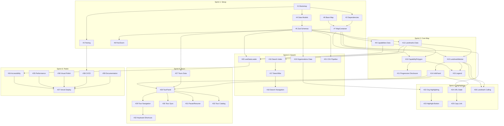

# Sprint Planning & Task Breakdown
## Terra Incognita Linguae - MVP Development

**Version:** 1.0
**Date:** October 1, 2025
**Project Manager:** Jordan (Engineering PM)
**Sprint Duration:** 2 weeks
**Total Timeline:** 12 weeks (6 sprints)

---

## Table of Contents

1. [Overview](#overview)
2. [Sprint Calendar](#sprint-calendar)
3. [Sprint Breakdown](#sprint-breakdown)
4. [GitHub Issues](#github-issues)
5. [Dependency Map](#dependency-map)
6. [Resource Allocation](#resource-allocation)
7. [Risk Management](#risk-management)

---

## Overview

This document provides the detailed sprint planning and task breakdown for the Terra Incognita Linguae MVP. It translates the high-level milestones from the PRD into actionable 2-week sprints with specific tasks, story points, and acceptance criteria.

### Key Metrics

- **Total Sprints:** 6 (12 weeks)
- **Total Story Points:** ~130 points
- **Estimated Velocity:** 20-25 points per sprint
- **Team Size:** 2-3 developers (1 senior, 1-2 mid-level)

### Sprint Goals Alignment

| Sprint | Milestone | Focus | Story Points |
|--------|-----------|-------|--------------|
| Sprint 1 | Milestone 1 | Project Setup & Core Map | 22 |
| Sprint 2 | Milestone 1 | Progressive Disclosure & Panels | 24 |
| Sprint 3 | Milestone 2 | Search & Data Pipeline | 20 |
| Sprint 4 | Milestone 2 | Organization Highlighting & Sharing | 18 |
| Sprint 5 | Milestone 3 | Guided Tours | 26 |
| Sprint 6 | Milestone 4 | Polish & Production | 20 |

---

## Sprint Calendar

```
Sprint 1: Week 1-2  (Days 1-10)   - Project Setup & Core Map
Sprint 2: Week 3-4  (Days 11-20)  - Progressive Disclosure & Info Panels
Sprint 3: Week 5-6  (Days 21-30)  - Search & Data Pipeline
Sprint 4: Week 7-8  (Days 31-40)  - Organization Highlighting & Sharing
Sprint 5: Week 9-10 (Days 41-50)  - Guided Tours
Sprint 6: Week 11-12 (Days 51-60) - Polish & Production Launch
```

---

## Sprint Breakdown

### Sprint 1: Project Setup & Core Map Foundation (Week 1-2)

**Goal:** Establish development environment and render basic interactive map

**Story Points:** 22

#### Tasks

| ID | Task | Story Points | Assignee | Dependencies | Priority |
|----|------|--------------|----------|--------------|----------|
| #1 | Project bootstrap: Next.js 14 + TypeScript setup | 3 | Dev 1 | None | P0 |
| #2 | Install dependencies (Leaflet, Zustand, Tailwind, shadcn/ui) | 2 | Dev 1 | #1 | P0 |
| #3 | Configure testing infrastructure (Vitest, Playwright, axe) | 3 | Dev 2 | #1 | P0 |
| #4 | Create TypeScript interfaces for core data models | 3 | Dev 2 | #1 | P0 |
| #5 | Implement Zod schemas for data validation | 2 | Dev 2 | #4 | P0 |
| #6 | Create base map image (4096×3072 PNG using Azgaar FMG) | 2 | Design | None | P0 |
| #7 | Implement MapContainer component with Leaflet + CRS.Simple | 5 | Dev 1 | #2, #6 | P0 |
| #8 | Add pan/zoom controls and basic interactions | 2 | Dev 1 | #7 | P0 |

#### Sprint 1 GitHub Issues

**Issue #1: Project Bootstrap**
```markdown
**Title:** Bootstrap Next.js 14 project with TypeScript

**Description:**
Initialize Next.js 14 project using App Router architecture with TypeScript configuration.

**Acceptance Criteria:**
- [ ] Next.js 14 project created with `npx create-next-app@latest`
- [ ] TypeScript configured with strict mode enabled
- [ ] App Router structure in place (`/src/app`)
- [ ] `tsconfig.json` configured with path aliases
- [ ] ESLint and Prettier configured
- [ ] Git repository initialized with `.gitignore`

**Story Points:** 3
**Priority:** P0
**Labels:** setup, infrastructure
```

**Issue #2: Install Core Dependencies**
```markdown
**Title:** Install and configure core dependencies

**Description:**
Install all required dependencies for mapping, state management, and UI components.

**Acceptance Criteria:**
- [ ] leaflet@1.9+ and react-leaflet@4.x installed
- [ ] zustand@4.x installed
- [ ] tailwindcss@3.4+ configured with shadcn/ui
- [ ] shadcn/ui CLI installed and initialized
- [ ] All peer dependencies resolved
- [ ] Package.json scripts configured (dev, build, test)

**Story Points:** 2
**Priority:** P0
**Labels:** setup, dependencies
**Dependencies:** #1
```

**Issue #3: Testing Infrastructure Setup**
```markdown
**Title:** Configure testing infrastructure

**Description:**
Set up unit testing (Vitest), E2E testing (Playwright), and accessibility testing (axe-core).

**Acceptance Criteria:**
- [ ] Vitest configured with React Testing Library
- [ ] Playwright configured for E2E tests
- [ ] axe-core integrated with Playwright
- [ ] Test directory structure created (`/tests/unit`, `/tests/integration`, `/tests/e2e`)
- [ ] Sample test passing for each test type
- [ ] CI workflow created (.github/workflows/ci.yml)

**Story Points:** 3
**Priority:** P0
**Labels:** testing, infrastructure
**Dependencies:** #1
```

**Issue #4: Core Data Model TypeScript Interfaces**
```markdown
**Title:** Define TypeScript interfaces for core data models

**Description:**
Create TypeScript type definitions for Capability, Landmark, Organization, Tour, and related types as specified in architecture.md Section 4.

**Acceptance Criteria:**
- [ ] `src/types/data.ts` created with all interfaces
- [ ] Capability interface with LatLng and VisualStyle types
- [ ] Landmark interface with ExternalLink type
- [ ] Organization interface
- [ ] Tour interface with TourStage type
- [ ] SearchResult interface
- [ ] ModelMetadata interface
- [ ] All types exported from `src/types/index.ts`

**Story Points:** 3
**Priority:** P0
**Labels:** data-model, types
**Dependencies:** #1
**Reference:** architecture.md Section 4
```

**Issue #5: Zod Validation Schemas**
```markdown
**Title:** Implement Zod schemas for runtime data validation

**Description:**
Create Zod schemas matching TypeScript interfaces to validate JSON data at load time.

**Acceptance Criteria:**
- [ ] `src/lib/schemas.ts` created with Zod schemas
- [ ] capabilitySchema validates Capability data
- [ ] landmarkSchema validates Landmark data
- [ ] organizationSchema validates Organization data
- [ ] tourSchema validates Tour data
- [ ] Schemas export TypeScript types via `z.infer<>`
- [ ] Unit tests for schema validation (valid and invalid cases)

**Story Points:** 2
**Priority:** P0
**Labels:** data-model, validation
**Dependencies:** #4
**Reference:** architecture.md Section 4
```

**Issue #6: Base Map Image Creation**
```markdown
**Title:** Create base fantasy map image

**Description:**
Generate 4096×3072 PNG base map using Azgaar Fantasy Map Generator with Terra Incognita Linguae theme.

**Acceptance Criteria:**
- [ ] Base map PNG exported at 4096×3072 resolution
- [ ] Map includes continents, oceans, and visual landmarks
- [ ] Color palette matches front-end spec style guide
- [ ] Map placed in `/public/images/map-base.png`
- [ ] Coordinate reference system documented
- [ ] Source FMG file saved to `/design/map-source.map`

**Story Points:** 2
**Priority:** P0
**Labels:** design, assets
**Reference:** front-end-spec.md Section 8 (Style Guide)
```

**Issue #7: MapContainer Component with Leaflet**
```markdown
**Title:** Implement MapContainer component with Leaflet CRS.Simple

**Description:**
Create the core map rendering component using Leaflet.js with CRS.Simple coordinate system for pixel-based positioning.

**Acceptance Criteria:**
- [ ] `src/components/map/MapContainer.tsx` created
- [ ] Leaflet map initialized with CRS.Simple
- [ ] ImageOverlay displays base map PNG
- [ ] Map bounds calculated from image dimensions
- [ ] Default zoom and center configured
- [ ] Map fills viewport (responsive)
- [ ] Component uses React-Leaflet declarative API
- [ ] Basic unit test verifies map initialization

**Story Points:** 5
**Priority:** P0
**Labels:** map, component, P0
**Dependencies:** #2, #6
**Reference:** architecture.md Section 5.1
```

**Issue #8: Pan and Zoom Controls**
```markdown
**Title:** Add pan/zoom controls and basic interactions

**Description:**
Implement pan, zoom, and drag interactions with sensible min/max zoom bounds.

**Acceptance Criteria:**
- [ ] Mouse drag pans the map
- [ ] Scroll wheel zooms in/out
- [ ] Zoom buttons (+/-) functional
- [ ] Min zoom shows full map
- [ ] Max zoom set to 3x base zoom
- [ ] Smooth zoom animations enabled
- [ ] Touch gestures work on tablet (pinch zoom, drag pan)
- [ ] E2E test verifies pan and zoom interactions

**Story Points:** 2
**Priority:** P0
**Labels:** map, interactions
**Dependencies:** #7
**Reference:** front-end-spec.md Section 6.1
```

#### Sprint 1 Deliverables

- ✅ Development environment fully configured
- ✅ Core data models and validation schemas
- ✅ Base map rendered in browser
- ✅ Pan/zoom interactions working
- ✅ Testing infrastructure operational
- ✅ CI pipeline running tests on PR

**Sprint 1 Demo:** Show basic map navigation in browser

---

### Sprint 2: Progressive Disclosure & Info Panels (Week 3-4)

**Goal:** Implement capability polygons with zoom-based rendering and detailed info panels

**Story Points:** 24

#### Tasks

| ID | Task | Story Points | Assignee | Dependencies | Priority |
|----|------|--------------|----------|--------------|----------|
| #9 | Create seed data: capabilities.json (10-15 capability regions) | 3 | Content | #5 | P0 |
| #10 | Implement CapabilityPolygon component | 4 | Dev 1 | #7, #9 | P0 |
| #11 | Implement progressive disclosure logic (zoom-based layers) | 3 | Dev 1 | #10 | P0 |
| #12 | Create seed data: landmarks.json (20-30 papers/models) | 3 | Content | #5 | P0 |
| #13 | Implement LandmarkMarker component | 4 | Dev 2 | #7, #12 | P0 |
| #14 | Implement InfoPanel component (right drawer) | 5 | Dev 2 | #13 | P0 |
| #15 | Implement LegendPanel component | 2 | Dev 1 | #10, #13 | P0 |

#### Sprint 2 GitHub Issues

**Issue #9: Seed Data - Capabilities**
```markdown
**Title:** Create seed capabilities.json with 10-15 regions

**Description:**
Curate and structure capability regions (continents, archipelagos, islands) representing LLM research areas.

**Acceptance Criteria:**
- [ ] `public/data/capabilities.json` created
- [ ] 10-15 capability regions defined (mix of continent/archipelago/island levels)
- [ ] Each capability has: id, name, description, level, polygonCoordinates, visualStyleHints
- [ ] Polygon coordinates mapped to base map locations
- [ ] Data validates against Zod schema
- [ ] Hierarchical relationships defined (parentCapabilityId)
- [ ] Regions cover: Attention, Alignment, Reasoning, Multimodal, Quantization, RLHF, Fine-tuning

**Story Points:** 3
**Priority:** P0
**Labels:** data, content
**Dependencies:** #5
**Reference:** prd.md Section 6.2, architecture.md Section 4.1
```

**Issue #10: CapabilityPolygon Component**
```markdown
**Title:** Implement CapabilityPolygon component for region rendering

**Description:**
Create React component to render capability regions as Leaflet polygons with styling and interactions.

**Acceptance Criteria:**
- [ ] `src/components/map/CapabilityPolygon.tsx` created
- [ ] Renders Leaflet Polygon from coordinates
- [ ] Applies visualStyleHints (fillColor, fillOpacity, strokeColor)
- [ ] Hover effect: outline highlighting
- [ ] Click opens InfoPanel with capability details
- [ ] Accessible: keyboard focusable, aria-label
- [ ] Component accepts Capability prop
- [ ] Unit test verifies rendering and click handler

**Story Points:** 4
**Priority:** P0
**Labels:** map, component, P0
**Dependencies:** #7, #9
**Reference:** architecture.md Section 5.1, front-end-spec.md Section 6.1
```

**Issue #11: Progressive Disclosure Logic**
```markdown
**Title:** Implement zoom-based progressive disclosure

**Description:**
Show/hide capability layers based on zoom level to prevent visual clutter.

**Acceptance Criteria:**
- [ ] `src/hooks/useProgressiveDisclosure.ts` custom hook created
- [ ] Hook returns visible capabilities based on current zoom
- [ ] Zoom thresholds: Z0 (continents), Z1 (archipelagos), Z2 (islands)
- [ ] Smooth transitions when layers appear/disappear
- [ ] Zustand store updated with current zoom level
- [ ] MapContainer filters rendered polygons by zoom
- [ ] Unit test verifies filtering logic
- [ ] E2E test verifies zoom behavior

**Story Points:** 3
**Priority:** P0
**Labels:** map, logic, P0
**Dependencies:** #10
**Reference:** prd.md Section 6.5, architecture.md Section 7.2
```

**Issue #12: Seed Data - Landmarks**
```markdown
**Title:** Create seed landmarks.json with 20-30 papers/models

**Description:**
Curate seminal papers and foundational models as map landmarks.

**Acceptance Criteria:**
- [ ] `public/data/landmarks.json` created
- [ ] 20-30 landmarks (mix of papers, models, tools, benchmarks)
- [ ] Each landmark has: id, name, type, year, organization, description, abstract, externalLinks, coordinates, capabilityId, tags
- [ ] Coordinates mapped to base map within capability regions
- [ ] Data validates against Zod schema
- [ ] Include: "Attention Is All You Need", GPT-2, GPT-3, BERT, InstructGPT, Llama, etc.
- [ ] External links to arXiv, GitHub, model cards

**Story Points:** 3
**Priority:** P0
**Labels:** data, content
**Dependencies:** #5
**Reference:** prd.md Section 6.3, architecture.md Section 4.2
```

**Issue #13: LandmarkMarker Component**
```markdown
**Title:** Implement LandmarkMarker component for papers/models

**Description:**
Create React component to render landmarks as custom Leaflet markers with icons.

**Acceptance Criteria:**
- [ ] `src/components/map/LandmarkMarker.tsx` created
- [ ] Renders Leaflet Marker at coordinates
- [ ] Custom icons by type (lighthouse for papers, ship for models)
- [ ] Click opens InfoPanel with landmark details
- [ ] Hover shows tooltip with name
- [ ] Accessible: keyboard focusable, aria-label
- [ ] Component accepts Landmark prop
- [ ] Unit test verifies rendering and interactions

**Story Points:** 4
**Priority:** P0
**Labels:** map, component, P0
**Dependencies:** #7, #12
**Reference:** architecture.md Section 5.1, front-end-spec.md Section 6.1
```

**Issue #14: InfoPanel Component (Right Drawer)**
```markdown
**Title:** Implement InfoPanel component for entity details

**Description:**
Create right-side drawer that displays detailed information for selected map entities.

**Acceptance Criteria:**
- [ ] `src/components/panels/InfoPanel.tsx` created
- [ ] Slide-in animation (300ms ease-out) from right
- [ ] Close button (X) and Esc key support
- [ ] Displays capability info (description, related landmarks)
- [ ] Displays landmark info (abstract, authors, year, links, tags)
- [ ] Deep links to related entities
- [ ] Scrollable content area
- [ ] Accessible: focus trap, aria-labels, keyboard navigation
- [ ] Uses shadcn/ui Sheet component
- [ ] Unit test verifies open/close and content rendering
- [ ] E2E test verifies user flow

**Story Points:** 5
**Priority:** P0
**Labels:** panel, component, P0
**Dependencies:** #13
**Reference:** prd.md Section 6.4, front-end-spec.md Section 6.3
```

**Issue #15: LegendPanel Component**
```markdown
**Title:** Implement LegendPanel component

**Description:**
Create always-visible legend in bottom-right corner explaining map symbols and zoom levels.

**Acceptance Criteria:**
- [ ] `src/components/panels/LegendPanel.tsx` created
- [ ] Fixed position bottom-right
- [ ] Icon legend (lighthouse = paper, ship = model, etc.)
- [ ] Zoom level indicator (current zoom displayed)
- [ ] Color legend for capability regions
- [ ] Compact design (non-intrusive)
- [ ] Optional expand/collapse functionality
- [ ] Accessible: keyboard focusable, screen-reader compatible
- [ ] Uses shadcn/ui Card component
- [ ] Unit test verifies rendering

**Story Points:** 2
**Priority:** P0
**Labels:** legend, component, P0
**Dependencies:** #10, #13
**Reference:** prd.md Section 6.6, front-end-spec.md Section 6.1
```

#### Sprint 2 Deliverables

- ✅ Capability polygons render at appropriate zoom levels
- ✅ Landmark markers display with custom icons
- ✅ InfoPanel opens on click with entity details
- ✅ Legend explains map symbols
- ✅ Progressive disclosure working smoothly
- ✅ 10-15 capabilities and 20-30 landmarks seeded

**Sprint 2 Demo:** Navigate map, zoom to see progressive disclosure, click landmarks to see info panel

---

### Sprint 3: Search & Data Pipeline (Week 5-6)

**Goal:** Enable fuzzy search and establish data curation workflow

**Story Points:** 20

#### Tasks

| ID | Task | Story Points | Assignee | Dependencies | Priority |
|----|------|--------------|----------|--------------|----------|
| #16 | Initialize Fuse.js search index | 3 | Dev 1 | #12 | P1 |
| #17 | Implement SearchBar component with combobox | 5 | Dev 1 | #16 | P1 |
| #18 | Implement search result navigation (pan/zoom to entity) | 3 | Dev 1 | #17 | P1 |
| #19 | Create seed data: organizations.json (10-15 orgs) | 2 | Content | #5 | P1 |
| #20 | Implement useDataLoader hook | 3 | Dev 2 | #5, #9, #12 | P0 |
| #21 | Create CSV-to-JSON data pipeline script | 4 | Dev 2 | #5 | P1 |

#### Sprint 3 GitHub Issues

**Issue #16: Fuse.js Search Index Initialization**
```markdown
**Title:** Initialize Fuse.js search index for client-side search

**Description:**
Set up Fuse.js with weighted search configuration across all searchable entities.

**Acceptance Criteria:**
- [ ] `src/lib/search.ts` created with Fuse.js configuration
- [ ] Search index built from capabilities, landmarks, organizations
- [ ] Weighted keys: name (weight 2), tags (weight 1.5), description (weight 1)
- [ ] Fuzzy matching threshold: 0.4
- [ ] Function: `initializeSearchIndex(data): Fuse`
- [ ] Function: `search(query, index): SearchResult[]`
- [ ] Unit test verifies search returns relevant results
- [ ] Performance test: search completes in <50ms

**Story Points:** 3
**Priority:** P1
**Labels:** search, library
**Dependencies:** #12
**Reference:** architecture.md Section 5.4, prd.md Section 6.7
```

**Issue #17: SearchBar Component**
```markdown
**Title:** Implement SearchBar component with instant dropdown

**Description:**
Create header search bar with fuzzy search and instant results dropdown.

**Acceptance Criteria:**
- [ ] `src/components/search/SearchBar.tsx` created
- [ ] Input field in header with search icon
- [ ] Debounced search (300ms delay)
- [ ] Instant dropdown shows top 10 results
- [ ] Results grouped by type (Papers, Models, Capabilities, Organizations)
- [ ] Keyboard navigation (up/down arrows, Enter to select)
- [ ] Selecting result pans/zooms to entity and opens InfoPanel
- [ ] Accessible: aria-autocomplete, aria-activedescendant
- [ ] Uses shadcn/ui Combobox component
- [ ] Unit test verifies search and selection
- [ ] E2E test verifies user search flow

**Story Points:** 5
**Priority:** P1
**Labels:** search, component, P1
**Dependencies:** #16
**Reference:** front-end-spec.md Section 6.2, architecture.md Section 5.4
```

**Issue #18: Search Result Navigation**
```markdown
**Title:** Implement navigation to search results on map

**Description:**
Pan and zoom map to selected search result entity.

**Acceptance Criteria:**
- [ ] `src/lib/utils.ts` function: `focusEntity(id, type, mapRef)`
- [ ] Function pans map to entity coordinates
- [ ] Function zooms to appropriate level for entity type
- [ ] Smooth animation using Leaflet.flyTo()
- [ ] Selected entity highlighted on map
- [ ] InfoPanel opens with entity details
- [ ] Zustand store action: `selectEntity(id, type)`
- [ ] Unit test verifies map state updates
- [ ] E2E test verifies smooth navigation

**Story Points:** 3
**Priority:** P1
**Labels:** search, navigation
**Dependencies:** #17
**Reference:** prd.md Section 6.7
```

**Issue #19: Seed Data - Organizations**
```markdown
**Title:** Create seed organizations.json with 10-15 organizations

**Description:**
Curate major LLM research organizations and labs.

**Acceptance Criteria:**
- [ ] `public/data/organizations.json` created
- [ ] 10-15 organizations (OpenAI, Google DeepMind, Meta AI, Anthropic, etc.)
- [ ] Each organization has: id, name, description, website, landmarkIds, color, logo
- [ ] landmarkIds reference landmarks in landmarks.json
- [ ] Highlight colors chosen from front-end spec palette
- [ ] Data validates against Zod schema
- [ ] Logo URLs (optional, can use placeholders)

**Story Points:** 2
**Priority:** P1
**Labels:** data, content
**Dependencies:** #5
**Reference:** prd.md Section 6.10, architecture.md Section 4.3
```

**Issue #20: useDataLoader Hook**
```markdown
**Title:** Implement useDataLoader hook for JSON data loading

**Description:**
Create custom React hook to load and validate all static JSON data at app startup.

**Acceptance Criteria:**
- [ ] `src/hooks/useDataLoader.ts` created
- [ ] Hook fetches all JSON files in parallel (capabilities, landmarks, organizations)
- [ ] Validates data against Zod schemas
- [ ] Returns loading state, error state, and data
- [ ] Memoizes data to prevent re-fetching
- [ ] Error handling for fetch failures and validation errors
- [ ] Hook integrates with Zustand store
- [ ] Unit test verifies data loading and validation
- [ ] E2E test verifies app loads data on startup

**Story Points:** 3
**Priority:** P0
**Labels:** data, hook, P0
**Dependencies:** #5, #9, #12
**Reference:** architecture.md Section 5.7
```

**Issue #21: CSV-to-JSON Data Pipeline Script**
```markdown
**Title:** Create CSV-to-JSON data pipeline script

**Description:**
Automate conversion of Google Sheets CSV exports to validated JSON files.

**Acceptance Criteria:**
- [ ] `scripts/csv-to-json.py` Python script created
- [ ] Script reads CSV files from `/csv/` directory
- [ ] Converts to JSON with proper type coercion
- [ ] Validates output against Zod schemas (via Node.js subprocess)
- [ ] Outputs to `/public/data/` directory
- [ ] Script handles errors gracefully with clear messages
- [ ] README.md documents CSV-to-JSON workflow
- [ ] Sample CSV files created for testing

**Story Points:** 4
**Priority:** P1
**Labels:** tooling, data-pipeline
**Dependencies:** #5
**Reference:** prd.md Section 7
```

#### Sprint 3 Deliverables

- ✅ Fuzzy search operational with instant results
- ✅ Clicking search result navigates to entity on map
- ✅ 10-15 organizations seeded
- ✅ Data loading hook validates and loads all JSON
- ✅ CSV-to-JSON pipeline established
- ✅ All data validated against Zod schemas

**Sprint 3 Demo:** Search for "attention", select result, map navigates to entity

---

### Sprint 4: Organization Highlighting & Snapshot Sharing (Week 7-8)

**Goal:** Enable contextual highlighting and shareable URLs

**Story Points:** 18

#### Tasks

| ID | Task | Story Points | Assignee | Dependencies | Priority |
|----|------|--------------|----------|--------------|----------|
| #22 | Implement organization highlighting logic | 4 | Dev 1 | #19 | P1 |
| #23 | Add "Highlight on Map" button to organization InfoPanel | 2 | Dev 1 | #22 | P1 |
| #24 | Implement URL state encoding/decoding | 5 | Dev 2 | #7, #14 | P2 |
| #25 | Add "Copy Link" button to header | 2 | Dev 2 | #24 | P2 |
| #26 | Implement viewport-based landmark culling | 5 | Dev 1 | #13 | P0 |

#### Sprint 4 GitHub Issues

**Issue #22: Organization Highlighting Logic**
```markdown
**Title:** Implement contextual highlighting by organization

**Description:**
Highlight all papers and models from a specific organization on the map.

**Acceptance Criteria:**
- [ ] Zustand store action: `highlightOrganization(orgId)`
- [ ] Action: `clearHighlights()`
- [ ] Map dims non-highlighted markers (opacity 0.3)
- [ ] Highlighted markers pulsate (scale animation)
- [ ] Highlighted markers have colored outline (org color)
- [ ] Count of highlighted items displayed in UI
- [ ] Highlighting persists until cleared
- [ ] Unit test verifies store state updates
- [ ] E2E test verifies visual highlighting

**Story Points:** 4
**Priority:** P1
**Labels:** highlighting, interaction
**Dependencies:** #19
**Reference:** prd.md Section 6.10
```

**Issue #23: "Highlight on Map" Button**
```markdown
**Title:** Add "Highlight on Map" button to organization InfoPanel

**Description:**
Enable users to highlight all contributions from an organization via InfoPanel button.

**Acceptance Criteria:**
- [ ] "Highlight on Map" button in organization InfoPanel
- [ ] Button triggers highlightOrganization() action
- [ ] Button shows "Clear Highlights" when active
- [ ] Visual feedback: button state changes when active
- [ ] Accessible: keyboard accessible, aria-pressed state
- [ ] Unit test verifies button triggers action
- [ ] E2E test verifies end-to-end flow

**Story Points:** 2
**Priority:** P1
**Labels:** panel, interaction
**Dependencies:** #22
**Reference:** prd.md Section 6.10
```

**Issue #24: URL State Encoding/Decoding**
```markdown
**Title:** Implement URL state encoding for snapshot sharing

**Description:**
Encode current map view state in URL for shareable links.

**Acceptance Criteria:**
- [ ] `src/lib/urlState.ts` created with serialize/deserialize functions
- [ ] Function: `serializeState(state): URLSearchParams`
- [ ] Function: `parseState(search): Partial<State>`
- [ ] URL params: lat, lng, zoom, selectedEntity, highlightedOrg
- [ ] On app load, parse URL and restore state
- [ ] URL updates on map interactions (debounced)
- [ ] Backward compatible: ignore unknown params
- [ ] Unit test verifies serialization/deserialization
- [ ] E2E test verifies shared link restores state

**Story Points:** 5
**Priority:** P2
**Labels:** sharing, state
**Dependencies:** #7, #14
**Reference:** prd.md Section 6.11
```

**Issue #25: "Copy Link" Button**
```markdown
**Title:** Add "Copy Link" button to header

**Description:**
Enable users to copy current map view URL to clipboard.

**Acceptance Criteria:**
- [ ] "Copy Link" button in header (with share icon)
- [ ] Button copies current URL to clipboard
- [ ] Toast notification: "Link copied to clipboard"
- [ ] Button accessible: keyboard accessible, aria-label
- [ ] Works across browsers (Clipboard API with fallback)
- [ ] Unit test verifies clipboard write
- [ ] E2E test verifies user flow

**Story Points:** 2
**Priority:** P2
**Labels:** sharing, UI
**Dependencies:** #24
**Reference:** prd.md Section 6.11
```

**Issue #26: Viewport-Based Landmark Culling**
```markdown
**Title:** Implement viewport-based landmark culling for performance

**Description:**
Only render landmarks within visible viewport + 20% buffer to optimize performance.

**Acceptance Criteria:**
- [ ] `src/hooks/useLandmarkCulling.ts` custom hook created
- [ ] Hook calculates visible map bounds
- [ ] Hook returns landmarks within viewport + 20% buffer
- [ ] Culling updates on pan/zoom (debounced 100ms)
- [ ] Performance: handles 200+ landmarks without lag
- [ ] Unit test verifies culling logic
- [ ] Performance test: 200 landmarks render in <16ms (60fps)

**Story Points:** 5
**Priority:** P0
**Labels:** performance, optimization
**Dependencies:** #13
**Reference:** architecture.md Section 2.5, prd.md Section 8
```

#### Sprint 4 Deliverables

- ✅ Organization highlighting working with visual feedback
- ✅ "Copy Link" button generates shareable URLs
- ✅ Shared links restore map state accurately
- ✅ Landmark culling improves map performance
- ✅ All P0/P1 features from Milestone 2 complete

**Sprint 4 Demo:** Highlight OpenAI contributions, share link, verify state restoration

---

### Sprint 5: Guided Tours (Week 9-10)

**Goal:** Implement guided tour interface with stage navigation

**Story Points:** 26

#### Tasks

| ID | Task | Story Points | Assignee | Dependencies | Priority |
|----|------|--------------|----------|--------------|----------|
| #27 | Create seed data: tours.json (3-5 tours with stages) | 4 | Content | #5 | P1 |
| #28 | Implement TourPanel component (right panel tour mode) | 6 | Dev 1 | #14, #27 | P1 |
| #29 | Implement tour stage navigation (Next/Previous) | 4 | Dev 1 | #28 | P1 |
| #30 | Implement tour map synchronization (flyTo, highlight) | 4 | Dev 2 | #28 | P1 |
| #31 | Implement tour pause/resume functionality | 4 | Dev 2 | #28 | P1 |
| #32 | Add keyboard shortcuts for tour navigation ([ and ]) | 2 | Dev 1 | #29 | P1 |
| #33 | Create tour selection/catalog interface | 2 | Dev 2 | #28 | P1 |

#### Sprint 5 GitHub Issues

**Issue #27: Seed Data - Tours**
```markdown
**Title:** Create seed tours.json with 3-5 guided tours

**Description:**
Curate guided tours representing LLM training pipelines and learning paths.

**Acceptance Criteria:**
- [ ] `public/data/tours.json` created
- [ ] 3-5 tours (e.g., "GPT Evolution", "RLHF Pipeline", "PEFT Fine-tuning")
- [ ] Each tour has: id, title, description, stages, estimatedDuration, difficulty
- [ ] Each stage has: index, title, description, landmarkIds, mapCenter, mapZoom, narration
- [ ] Tours reference existing landmarks
- [ ] Data validates against Zod schema
- [ ] Tours cover beginner, intermediate, and advanced levels

**Story Points:** 4
**Priority:** P1
**Labels:** data, content
**Dependencies:** #5
**Reference:** prd.md Section 6.9, architecture.md Section 4.4
```

**Issue #28: TourPanel Component (Tour Mode)**
```markdown
**Title:** Implement TourPanel component for guided tours

**Description:**
Create tour interface in right panel that switches from info mode to tour mode.

**Acceptance Criteria:**
- [ ] `src/components/panels/TourPanel.tsx` created
- [ ] Right panel switches mode: 'info' | 'tour'
- [ ] Tour header shows tour title and progress bar
- [ ] Stage content shows: stage title, narration, key landmarks
- [ ] Progress indicator: "Stage 2 of 5"
- [ ] Exit tour button returns to info mode
- [ ] Panel uses same slide-in animation as InfoPanel
- [ ] Accessible: focus management, aria-labels
- [ ] Uses shadcn/ui Progress component
- [ ] Unit test verifies tour mode rendering

**Story Points:** 6
**Priority:** P1
**Labels:** panel, component, tour, P1
**Dependencies:** #14, #27
**Reference:** prd.md Section 6.9, front-end-spec.md Section 6.4
```

**Issue #29: Tour Stage Navigation**
```markdown
**Title:** Implement tour stage navigation (Next/Previous)

**Description:**
Add navigation controls to advance or go back in tour stages.

**Acceptance Criteria:**
- [ ] "Next Stage" button at bottom of TourPanel
- [ ] "Previous" button at bottom of TourPanel
- [ ] Previous disabled on stage 1
- [ ] Next button text: "Complete Tour" on last stage
- [ ] Zustand store actions: `advanceTourStage('next' | 'previous')`
- [ ] Stage transition updates map (pan/zoom to new stage)
- [ ] Progress bar updates smoothly
- [ ] Accessible: keyboard navigation, aria-controls
- [ ] Unit test verifies stage navigation logic
- [ ] E2E test verifies tour flow

**Story Points:** 4
**Priority:** P1
**Labels:** tour, navigation
**Dependencies:** #28
**Reference:** prd.md Section 6.9, front-end-spec.md Section 6.4
```

**Issue #30: Tour Map Synchronization**
```markdown
**Title:** Implement tour map synchronization (flyTo, highlight)

**Description:**
Synchronize map state with active tour stage (pan, zoom, highlight landmarks).

**Acceptance Criteria:**
- [ ] On stage change, map flies to stage.mapCenter and stage.mapZoom
- [ ] Smooth animation using Leaflet.flyTo() (1000ms duration)
- [ ] Stage landmarks highlighted with glow effect
- [ ] Previous stage landmarks dimmed (opacity 0.4)
- [ ] Future stage landmarks subtle outline only
- [ ] Zustand store syncs tour state with map state
- [ ] Unit test verifies map state updates
- [ ] E2E test verifies smooth tour progression

**Story Points:** 4
**Priority:** P1
**Labels:** tour, map, synchronization
**Dependencies:** #28
**Reference:** front-end-spec.md Section 6.4, architecture.md Section 6.3
```

**Issue #31: Tour Pause/Resume Functionality**
```markdown
**Title:** Implement tour pause/resume functionality

**Description:**
Allow users to pause tour to explore other landmarks and resume where they left off.

**Acceptance Criteria:**
- [ ] Clicking non-tour landmark pauses tour
- [ ] TourPanel collapses to compact banner: "Tour paused - [Resume Tour]"
- [ ] InfoPanel opens with clicked landmark details
- [ ] "Resume Tour" button returns to active tour stage
- [ ] Zustand store actions: `pauseTour(landmarkId)`, `resumeTour()`
- [ ] Tour state persists paused landmark ID
- [ ] Unit test verifies pause/resume logic
- [ ] E2E test verifies pause/resume flow

**Story Points:** 4
**Priority:** P1
**Labels:** tour, interaction
**Dependencies:** #28
**Reference:** prd.md Section 6.9, front-end-spec.md Section 6.5
```

**Issue #32: Tour Keyboard Shortcuts**
```markdown
**Title:** Add keyboard shortcuts for tour navigation

**Description:**
Enable keyboard shortcuts [ and ] for previous/next tour stages.

**Acceptance Criteria:**
- [ ] `[` key navigates to previous stage
- [ ] `]` key navigates to next stage
- [ ] Shortcuts only active when tour is running
- [ ] Visual indicator in TourPanel: "Use [ ] keys to navigate"
- [ ] Shortcuts don't conflict with other keyboard interactions
- [ ] Accessible: documented in keyboard navigation map
- [ ] Unit test verifies keyboard event handling
- [ ] E2E test verifies keyboard navigation

**Story Points:** 2
**Priority:** P1
**Labels:** tour, accessibility
**Dependencies:** #29
**Reference:** prd.md Section 6.9
```

**Issue #33: Tour Selection/Catalog Interface**
```markdown
**Title:** Create tour selection/catalog interface

**Description:**
Enable users to discover and start tours from a catalog.

**Acceptance Criteria:**
- [ ] Tour catalog accessible from header or map overlay
- [ ] Lists all available tours with title, description, difficulty, duration
- [ ] Clicking tour starts tour (opens TourPanel with stage 1)
- [ ] Tours searchable via main search bar (type: "tour")
- [ ] Accessible: keyboard navigation, aria-labels
- [ ] Uses shadcn/ui Dialog or Popover component
- [ ] Unit test verifies tour start action
- [ ] E2E test verifies tour discovery and start flow

**Story Points:** 2
**Priority:** P1
**Labels:** tour, UI
**Dependencies:** #28
**Reference:** prd.md Section 6.9
```

#### Sprint 5 Deliverables

- ✅ 3-5 guided tours seeded with multi-stage narratives
- ✅ TourPanel renders in right panel (tour mode)
- ✅ Tour navigation (Next/Previous) works smoothly
- ✅ Map synchronizes with tour stages (flyTo, highlight)
- ✅ Pause/resume functionality operational
- ✅ Keyboard shortcuts [ and ] functional
- ✅ Tour catalog enables discovery

**Sprint 5 Demo:** Start "GPT Evolution" tour, navigate stages, pause to explore, resume tour

---

### Sprint 6: Polish & Production Launch (Week 11-12)

**Goal:** Accessibility audit, performance optimization, and production deployment

**Story Points:** 20

#### Tasks

| ID | Task | Story Points | Assignee | Dependencies | Priority |
|----|------|--------------|----------|--------------|----------|
| #34 | Accessibility audit and fixes (axe, keyboard, WCAG AA) | 5 | Dev 2 | All UI | P0 |
| #35 | Performance optimization (memoization, code splitting) | 4 | Dev 1 | All | P0 |
| #36 | Visual polish (animations, transitions, theming) | 3 | Dev 1 | All UI | P1 |
| #37 | Vercel deployment configuration | 2 | Dev 2 | #1 | P0 |
| #38 | CI/CD pipeline with automated tests | 3 | Dev 2 | #3 | P0 |
| #39 | Documentation: README, CONTRIBUTING, setup guide | 3 | Both | All | P1 |

#### Sprint 6 GitHub Issues

**Issue #34: Accessibility Audit and Fixes**
```markdown
**Title:** Comprehensive accessibility audit and fixes

**Description:**
Ensure WCAG 2.1 AA compliance with keyboard navigation, screen reader support, and axe-core validation.

**Acceptance Criteria:**
- [ ] axe-core audit run on all pages: 0 critical violations
- [ ] All interactive elements keyboard accessible (Tab, Enter, Esc)
- [ ] Visible focus states on all focusable elements
- [ ] ARIA labels on all panels, buttons, landmarks
- [ ] Color contrast ≥ 4.5:1 for text
- [ ] Screen reader testing: NVDA/JAWS can access all content
- [ ] Keyboard navigation map documented
- [ ] Accessibility testing integrated into CI
- [ ] E2E accessibility tests pass

**Story Points:** 5
**Priority:** P0
**Labels:** accessibility, P0, testing
**Dependencies:** All UI components
**Reference:** prd.md Section 6.12, front-end-spec.md Section 9
```

**Issue #35: Performance Optimization**
```markdown
**Title:** Performance optimization across the application

**Description:**
Optimize bundle size, component rendering, and runtime performance to meet Lighthouse targets.

**Acceptance Criteria:**
- [ ] Code splitting: lazy-load TourPanel, SearchResults
- [ ] React.memo for pure components (LandmarkMarker, CapabilityPolygon)
- [ ] Memoize expensive computations (search index, filtered lists)
- [ ] Image optimization: next/image for logos/icons
- [ ] Bundle analysis: total JS <150KB gzipped
- [ ] Lighthouse Performance score ≥ 85 (desktop)
- [ ] First Contentful Paint < 1.5s
- [ ] Time to Interactive < 3s
- [ ] Performance testing in CI

**Story Points:** 4
**Priority:** P0
**Labels:** performance, P0, optimization
**Dependencies:** All components
**Reference:** prd.md Section 10, architecture.md Section 11.2
```

**Issue #36: Visual Polish**
```markdown
**Title:** Visual polish and animation refinement

**Description:**
Enhance visual design with smooth animations, transitions, and consistent theming.

**Acceptance Criteria:**
- [ ] Smooth panel slide-in animations (300ms ease-out)
- [ ] Hover effects on interactive elements
- [ ] Loading states and skeleton screens
- [ ] Error states with user-friendly messages
- [ ] Map transitions smooth (flyTo animations)
- [ ] Consistent color palette from style guide
- [ ] Dark mode support (optional)
- [ ] Visual regression testing setup

**Story Points:** 3
**Priority:** P1
**Labels:** UI, polish, design
**Dependencies:** All UI components
**Reference:** front-end-spec.md Section 11 (Animations)
```

**Issue #37: Vercel Deployment Configuration**
```markdown
**Title:** Configure Vercel deployment

**Description:**
Set up Vercel project with optimal configuration for production deployment.

**Acceptance Criteria:**
- [ ] Vercel project created and linked to Git repository
- [ ] Build command: `npm run build`
- [ ] Output directory: `.next`
- [ ] Environment variables configured
- [ ] Custom domain configured (optional)
- [ ] HTTPS enforced
- [ ] Preview deployments enabled for PRs
- [ ] Production deployment successful
- [ ] Vercel Analytics enabled

**Story Points:** 2
**Priority:** P0
**Labels:** deployment, infrastructure, P0
**Dependencies:** #1
**Reference:** architecture.md Section 10
```

**Issue #38: CI/CD Pipeline**
```markdown
**Title:** Comprehensive CI/CD pipeline with automated tests

**Description:**
Set up GitHub Actions workflow for automated testing and deployment.

**Acceptance Criteria:**
- [ ] `.github/workflows/ci.yml` created
- [ ] CI runs on: push to main, pull requests
- [ ] CI steps: lint, type-check, unit tests, integration tests, E2E tests, accessibility tests
- [ ] Build verification step
- [ ] CI badge in README.md
- [ ] Deployment to Vercel on merge to main
- [ ] PR previews deployed automatically
- [ ] CI runs in <5 minutes

**Story Points:** 3
**Priority:** P0
**Labels:** CI/CD, infrastructure, P0
**Dependencies:** #3
**Reference:** architecture.md Section 9
```

**Issue #39: Documentation**
```markdown
**Title:** Comprehensive project documentation

**Description:**
Create developer-friendly documentation for setup, contribution, and architecture.

**Acceptance Criteria:**
- [ ] README.md: project overview, features, demo link, setup instructions
- [ ] CONTRIBUTING.md: contribution guidelines, code standards, PR process
- [ ] docs/setup.md: detailed local development setup
- [ ] docs/architecture.md: updated with final implementation details
- [ ] Code comments for complex logic
- [ ] JSDoc comments for exported functions/components
- [ ] Storybook setup (optional) for component documentation

**Story Points:** 3
**Priority:** P1
**Labels:** documentation
**Dependencies:** All components
**Reference:** architecture.md, front-end-spec.md, prd.md
```

#### Sprint 6 Deliverables

- ✅ Zero critical accessibility violations
- ✅ Lighthouse Performance score ≥ 85
- ✅ Production deployment on Vercel
- ✅ CI/CD pipeline operational
- ✅ Comprehensive documentation
- ✅ MVP ready for public launch

**Sprint 6 Demo:** Full application walkthrough with all features, performance metrics, accessibility compliance

---

## Dependency Map



---

## Resource Allocation

### Team Structure

**Recommended Team Size:** 2-3 developers

#### Developer Roles

**Senior Full-Stack Developer (Dev 1):**
- Sprint 1: Project setup, MapContainer, Pan/Zoom
- Sprint 2: CapabilityPolygon, Progressive Disclosure, Legend
- Sprint 3: Search index, SearchBar, Search navigation
- Sprint 4: Organization highlighting, Landmark culling
- Sprint 5: TourPanel, Tour navigation, Keyboard shortcuts
- Sprint 6: Performance optimization, Visual polish

**Mid-Level Full-Stack Developer (Dev 2):**
- Sprint 1: Testing setup, Data models, Zod schemas
- Sprint 2: LandmarkMarker, InfoPanel
- Sprint 3: useDataLoader, CSV pipeline
- Sprint 4: URL state, Copy Link button
- Sprint 5: Tour sync, Pause/resume, Tour catalog
- Sprint 6: Accessibility audit, Deployment, CI/CD, Documentation

**Content Curator / Designer (Part-time):**
- Sprint 1: Base map creation
- Sprint 2-5: Seed data creation (capabilities, landmarks, organizations, tours)
- Sprint 6: Visual polish, style guide refinement

### Workload Balance

| Sprint | Dev 1 | Dev 2 | Content/Design |
|--------|-------|-------|----------------|
| Sprint 1 | 12 pts | 10 pts | 2 pts |
| Sprint 2 | 9 pts | 12 pts | 6 pts |
| Sprint 3 | 11 pts | 7 pts | 2 pts |
| Sprint 4 | 11 pts | 7 pts | 0 pts |
| Sprint 5 | 14 pts | 8 pts | 4 pts |
| Sprint 6 | 7 pts | 10 pts | 0 pts |

---

## Risk Management

### Critical Risks

| Risk | Probability | Impact | Mitigation | Owner |
|------|-------------|--------|------------|-------|
| **Content curation bottleneck** | High | High | Start with minimal dataset (10 capabilities, 20 landmarks); expand iteratively | Content |
| **Leaflet CRS.Simple complexity** | Medium | High | Spike task in Sprint 1; fallback to standard tile layers if needed | Dev 1 |
| **Performance with 100+ markers** | Medium | Medium | Landmark culling (#26) prioritized; performance testing in Sprint 4 | Dev 1 |
| **Accessibility compliance** | Low | High | Automated axe testing from Sprint 1; manual testing in Sprint 6 | Dev 2 |
| **Tour UX complexity** | Medium | Medium | User testing in Sprint 5; iterate based on feedback | Both |
| **Sprint velocity variance** | Medium | Medium | 20% buffer in estimates; defer P2 tasks if needed | PM |

### Mitigation Strategies

1. **Content Risk:** Prepare minimal viable datasets in parallel with development
2. **Technical Risk:** Daily standups to surface blockers early; spike tasks for unknowns
3. **Scope Risk:** P2 features can be deferred without breaking MVP (snapshot sharing)
4. **Timeline Risk:** Sprint reviews adjust priorities; defer polish if needed

---

## Definition of Done

### Task-Level DoD

- [ ] Code implemented and tested (unit tests pass)
- [ ] Code reviewed and approved by peer
- [ ] No linting or TypeScript errors
- [ ] Acceptance criteria met
- [ ] Accessible (keyboard, ARIA, axe violations = 0)
- [ ] Responsive (works on desktop + tablet)
- [ ] Documented (JSDoc comments, README updates)
- [ ] Merged to main branch

### Sprint-Level DoD

- [ ] All P0 tasks completed
- [ ] Sprint demo successful
- [ ] No critical bugs
- [ ] CI pipeline green
- [ ] Performance benchmarks met
- [ ] Retrospective conducted
- [ ] Next sprint planned

### MVP Launch DoD

- [ ] All P0 features complete and tested
- [ ] Lighthouse Performance ≥ 85
- [ ] Zero critical accessibility violations
- [ ] Deployed to production (Vercel)
- [ ] Documentation complete
- [ ] User testing conducted (5+ users)
- [ ] Monitoring and analytics enabled

---

## Success Metrics

### Sprint Velocity Tracking

**Target Velocity:** 20-25 story points per sprint

| Sprint | Planned | Completed | Velocity | Burndown |
|--------|---------|-----------|----------|----------|
| Sprint 1 | 22 | TBD | TBD | TBD |
| Sprint 2 | 24 | TBD | TBD | TBD |
| Sprint 3 | 20 | TBD | TBD | TBD |
| Sprint 4 | 18 | TBD | TBD | TBD |
| Sprint 5 | 26 | TBD | TBD | TBD |
| Sprint 6 | 20 | TBD | TBD | TBD |

### Quality Metrics

- **Code Coverage:** >80% (unit tests)
- **E2E Test Coverage:** 100% of critical user paths
- **Accessibility:** 0 critical axe violations
- **Performance:** Lighthouse ≥ 85
- **Bug Density:** <3 bugs per 100 story points

---

## Next Steps

### Immediate Actions (Pre-Sprint 1)

1. **GitHub Setup:**
   - Create GitHub repository
   - Set up project board with columns: Backlog, In Progress, Review, Done
   - Create all issues from this document using templates below

2. **Team Onboarding:**
   - Share PRD, Architecture, Front-End Spec, and Sprint Planning docs
   - Schedule Sprint 1 kickoff meeting
   - Set up communication channels (Slack, Discord)

3. **Environment Prep:**
   - Provision Vercel account
   - Set up development environment guidelines
   - Prepare design assets (map, icons)

4. **Sprint 1 Kickoff:**
   - Sprint planning meeting
   - Task assignments
   - Estimate refinement
   - Begin development

---

## GitHub Issue Template

Use this template when creating issues in GitHub:

```markdown
**Title:** [Concise task description]

**Description:**
[Detailed description of what needs to be built]

**Acceptance Criteria:**
- [ ] Criterion 1
- [ ] Criterion 2
- [ ] Criterion 3

**Story Points:** [1-8]

**Priority:** [P0 | P1 | P2]

**Labels:** [component, feature-area, priority]

**Dependencies:** [#issue-numbers]

**Reference:** [Link to docs: prd.md, architecture.md, front-end-spec.md]

**Notes:**
[Additional context, technical considerations, or design decisions]
```

---

## Appendix: Story Point Guide

| Points | Complexity | Effort | Example |
|--------|------------|--------|---------|
| 1 | Trivial | <2 hours | Add button, update copy |
| 2 | Simple | 2-4 hours | Simple component, basic logic |
| 3 | Moderate | 4-8 hours | Component with state, hook |
| 5 | Complex | 1-2 days | Feature with multiple components |
| 8 | Very Complex | 2-3 days | Major feature, refactoring |
| 13 | Epic | 3-5 days | Should be broken down |

**Note:** Story points are relative estimates, not absolute time. Velocity is team-specific.

---

**Document Version:** 1.0
**Last Updated:** October 1, 2025
**Status:** ✅ Ready for Sprint 1 Kickoff

---

*This sprint plan is a living document. Update after each sprint retrospective to reflect learnings and adjust future sprint plans accordingly.*
